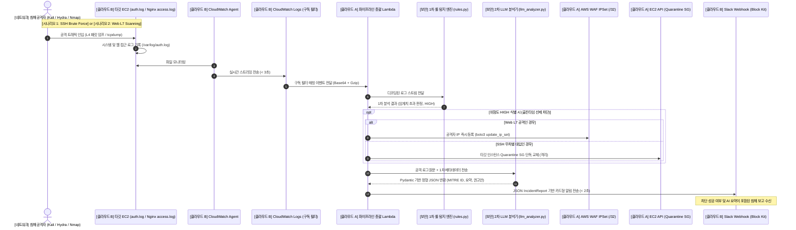

# CloudShield: Cloud Hybrid Threat Detection & Auto-Response Pipeline

<div align="center">

**클라우드 하이브리드 위협 탐지·자동 대응 및 SecOps 파이프라인**

[](https://www.python.org/)
[](https://github.com/astral-sh/ruff)
[](https://docs.pytest.org/)
[](http://docs.getmoto.org/)
[](https://trivy.dev/)
[](https://conventionalcommits.org)

</div>

---

## 1. 프로젝트 개요 및 추진 배경

* **프로젝트명**: CloudShield (클라우드 하이브리드 위협 탐지·자동 대응 및 SecOps 파이프라인)
* **목표 인프라 골든타임**: 침해 공격 인입 시 **10초 이내 완전 자동 대응**
  - **로그 수집 (<3s) $\rightarrow$ 위험도 판정 (<5s) $\rightarrow$ 원자적 복합 차단 (<2s) $\rightarrow$ SecOps 상황 전파**
* **추진 배경**:
  - **수동 침해 분석의 한계**: 클라우드 인프라 대상 무차별 대입, 비인가 스캐닝 등은 발생 수 분 내에 측면 이동으로 전이되므로 사람의 수동 분석으로는 피해를 막을 수 없습니다.
  - **파이프라인 중심 아키텍처**: 웹 UI 개발에 리소스를 분산하지 않고, **실제 인프라 라우팅, L4 패킷 플래그, 탐지 시그니처, IAM 세션 무효화, IaC 등 클라우드 보안 엔지니어링 핵심 역량**을 증빙할 수 있도록 단일 관통 파이프라인 형태로 설계했습니다.

---

## 2. 10초 관통 파이프라인 아키텍처

CloudShield는 L4 네트워크 레벨 공격과 L7 애플리케이션 레벨 공격을 동시에 수용하는 하이브리드 탐지·대응 파이프라인을 구축합니다:



---

## 3. 실증 침해 시나리오

CloudShield는 실무에서 빈번히 발생하는 2대 대표 침해 공격에 대해 원자적 차단을 실증합니다:

| 구분 | [시나리오 1] SSH Brute Force (L4) | [시나리오 2] Web L7 Directory Scanning & Spraying |
| :--- | :--- | :--- |
| **공격 도구** | Hydra, Nmap (`network/attack_simulation.sh`) | Curl, Gobuster, Nikto |
| **인입 경로** | SSH 포트(TCP 22) 패스워드 무차별 대입 | Web HTTP/HTTPS(80/443) 비인가 디렉토리 탐색 및 로그인 시도 |
| **타깃 로그** | `/var/log/auth.log` (`SyslogAuthEvent`) | `/var/log/nginx/access.log` (HTTP 4xx/5xx 연속 발생) |
| **1차 탐지 룰** | 동일 IP 기준 5회 이상 인증 실패 / 다중 계정 스프레잉 | 짧은 시간 내 비인가 URL 패턴 탐색 및 401/403/404 임계치 초과 |
| **MITRE ATT&CK** | `T1110.001` (Brute Force: Password Guessing) | `T1110.003` (Password Spraying), `T1595.002` (Active Scanning) |
| **원자적 조치** | **L4 EC2 Quarantine SG 단독 교체** (측면 이동 원천 차단) | **L7 AWS WAF IPSet `/32` 차단** (외부 트래픽 인바운드 드롭) |
| **전파 채널** | Slack Block Kit (`quarantine_applied: true`, MITRE ID) | Slack Block Kit (`waf_blocked: true`, 공격자 IP/32) |
| **테스트베드** | `mock_auth.log`, `mocked_ec2_target` (Moto 가상 VPC) | `mock_incident_waf_only.json`, `mocked_waf_ipset` (Moto 가상 WAF) |

---

## 4. 팀 구성 및 도메인 책임 매트릭스

본 프로젝트는 모듈 간 결합도를 낮추고 각 도메인의 독립적 책임을 명확히 하기 위해, 단일 소유권 원칙에 따라 역할을 엄격히 분리하여 운영합니다:

| 직무 | 핵심 도메인 및 R&R | 핵심 산출물 및 기술 성과 | 공식 결과 보고서 |
| :--- | :--- | :--- | :---: |
| **네트워크** | - VPC/Subnet 네트워크 토폴로지 설계<br>- Hydra/Nmap 모의 공격 시뮬레이션<br>- `tcpdump`/Wireshark L4 TCP 플래그 분석<br>- 격리 Security Group 인/아웃바운드 규칙 명세 | `network/attack_simulation.sh`<br>`network/reports/` (Wireshark 분석) | [네트워크 결과 보고](docs/roles/network/README.md) |
| **클라우드 B** | - 타깃 인스턴스(Ubuntu/Nginx) 환경 구성<br>- CloudWatch Agent 중앙 로깅 파이프라인<br>- CloudWatch Subscription Filter 설계<br>- Slack Incoming Webhook + Block Kit 알림 모듈 | `amazon-cloudwatch-agent.json`<br>`src/collector/cw_processor.py`<br>`src/reporter/slack_notifier.py` | [클라우드 B 결과 보고](docs/roles/cloud-b/README.md) |
| **보안** | - 정규식 기반 1차 시그니처 룰 엔진 (`rules.py`)<br>- MITRE ATT&CK TTP 1:1 매핑 정의<br>- LLM Few-shot 프롬프트 & Pydantic 구조화 출력<br>- 오탐/정탐 분류 기준 및 대응 우선순위 수립 | `src/detection/rules.py`<br>`src/detection/llm_analyzer.py`<br>`tests/unit/test_rules.py` | [보안 결과 보고](docs/roles/security/README.md) |
| **클라우드 A<br>(플랫폼 리드)** | - 전체 AWS 리소스 Terraform IaC 모듈화<br>- Boto3 원자적 복합 차단 엔진 (`remediation.py`)<br>- GitHub Actions CI/CD (OIDC 무인증 배포)<br>- Moto 기반 가상 AWS 테스트베드 및 하네스 구축 | `infra/terraform/`<br>`src/remediation/remediation.py`<br>`tests/conftest.py`<br>`.github/workflows/` | [클라우드 A 결과 보고](docs/roles/cloud-a/README.md) |

---

## 5. 개발 하네스 및 에이전트 거버넌스

팀원 전원이 AI 코딩 에이전트를 활용하여 개발을 수행함에 따라, **에이전트의 컨텍스트 왜곡 및 임의 스키마 변경을 방지하는 엔터프라이즈급 개발 하네스**를 사전 구축하여 운영합니다:

```text
[로컬 에이전트 거버넌스]                     [원격 GitHub Actions 거버넌스]
┌─────────────────────────────────┐       ┌─────────────────────────────────┐
│ 1. 로컬 역할 잠금 (.agent-role)   │       │ 1. CI (Ruff / Pytest / Contract)│
│    - 본인 직무 외 디렉토리 수정 차단 │ ──Push─>│    - Pydantic 스키마 무단 변경 차단│
│ 2. 세션 스타터 (get_my_tasks.js) │       │ 2. PR Title Lint (Conventional) │
│    - 노션 [시작 전] 티켓 자동 바인딩│       │ 3. 자동 라벨러 (labeler.yml)    │
│ 3. Moto 가상 AWS 로컬 테스트베드  │       │ 4. 노션 칸반 상태 원자적 자동 동기화│
└─────────────────────────────────┘       └─────────────────────────────────┘
```

* **Contract-First 불변 모델 (`src/contracts/`)**:
  - `IncidentReport` (`src/contracts/incident.py`): Pydantic V2 기반 불변(`frozen=True`, `extra="forbid"`) 데이터 스키마. IPv4 유효성 및 EC2 인스턴스 ID 정밀 검증기 내장.
  - `CloudWatchLogsPayload` & `SyslogAuthEvent` (`src/contracts/events.py`): Gzip/Base64 압축 해제 팩토리 및 Syslog 정규식 파서 제공.
* **Moto 로컬 테스트베드 (`tests/conftest.py`)**:
  - 실제 AWS 과금 및 키 유출 위험 없이 로컬에서 WAFv2 IPSet, EC2 Quarantine SG, IAM Session 모킹 검증.
* **노션 칸반 자동 동기화 (`.github/workflows/notion_sync.yml`)**:
  - Issue/PR 수명주기와 노션 [프로젝트 일정] DB의 `[진행 중]` $\rightarrow$ `[검토 중]` $\rightarrow$ `[완료]` 및 작업 기간을 100% 자동 동기화.

> 📖 **개발 하네스 상세 아키텍처 및 보고서**: [docs/07_collaboration_and_agent_setup.md](docs/07_collaboration_and_agent_setup.md) 및 [docs/roles/cloud-a/2026-09-04-agent-governance-harness.md](docs/roles/cloud-a/2026-09-04-agent-governance-harness.md)

---

## 6. 협업 규칙 및 Git 컨벤션

### 6.1 브랜치 전략 (GitHub Flow)
* `main` 브랜치에 직접 Push하지 않으며, 반드시 PR을 통해 리뷰 및 CI 통과 후 Squash Merge합니다.
* 브랜치 네이밍 규칙:
  - `feat/<직무>-<기능명>` (예: `feat/security-rules-engine`, `feat/cloud-b-slack-card`)
  - `fix/<이슈명>`
  - `chore/<작업명>`

### 6.2 커밋 메시지 컨벤션
* **형식**: `<type>(<scope>): <한글 요약>` (마침표 없음)
* **Type**: `feat`, `fix`, `refactor`, `docs`, `chore`, `test`, `style`, `perf`, `ci`
* **Scope**: 담당 직무 및 도메인 명시 필수 (`contract`, `cloud-a`, `cloud-b`, `security`, `network`, `infra`)
* **예시**:
  - `feat(security): SSH 무차별 대입 1차 시그니처 룰 구현`
  - `feat(cloud-a): Boto3 WAF IPSet 원자적 등록 모듈 구현`
  - `chore(cloud-b): CloudWatch Agent 설정 파일 JSON 검증`

### 6.3 로컬 검증 3대 명령어
모든 커밋 및 PR 생성 전 아래 명령어를 반드시 통과해야 합니다:
```powershell
uv run ruff check .
uv run ruff format --check .
uv run pytest
```

---

## 7. 디렉토리 구조 및 모듈 책임 맵

```text
aleph-project/
├── .agent-role                       # 로컬 코딩 에이전트 역할 잠금 (Role-Lock)
├── .github/
│   ├── CODEOWNERS                    # 직무별 파일 단독 소유권 및 필수 리뷰어 지정
│   ├── pull_request_template.md      # 원리 요약 3줄 강제 PR 템플릿
│   └── workflows/
│       ├── ci.yml                    # Ruff 린트, Pytest, Contract Drift Guard 검증
│       ├── pr_title_lint.yml         # Conventional Commit 및 직무 스코프 검사
│       ├── labeler.yml               # 경로 기반 role:*, area:*, type:* 자동 라벨러
│       └── notion_sync.yml           # GitHub <-> 노션 칸반 일정 자동 동기화 배관
├── src/
│   ├── contracts/                    # [절대 동결] 직무 간 Pydantic V2 인터페이스 규격
│   │   ├── incident.py               # IncidentReport 불변 모델
│   │   └── events.py                 # SyslogAuthEvent 및 CW Logs 페이로드 모델
│   ├── collector/                    # [클라우드 B] CW Logs 수신 및 Gzip 디코더
│   ├── detection/                    # [보안] 1차 룰 엔진(rules.py) 및 LLM 분석기
│   ├── remediation/                  # [클라우드 A] Boto3 WAF/SG/IAM 원자적 차단 엔진
│   └── reporter/                     # [클라우드 B] Slack Block Kit 카드 알림 모듈
├── network/                          # [네트워크] Hydra/Nmap 모의 공격 스크립트 및 패킷 분석
├── infra/                            # [클라우드 A] Terraform AWS 인프라 IaC 모듈
├── scripts/
│   ├── check.ps1                     # 로컬 품질 검사 일괄 실행 스크립트
│   ├── get_my_tasks.js               # 노션 [시작 전] 티켓 자동 조회 CLI
│   └── verify_notion_api.js          # 노션 API 연동 상태 진단 스크립트
├── tests/
│   ├── conftest.py                   # Moto 가상 AWS 리소스 및 표준 Mock 픽스처
│   ├── mock_data/                    # 표준 공격 로그 및 Mock 인시던트 데이터셋 6종
│   ├── test_contracts.py             # 데이터 계약 불변성 및 Drift Guard 검증
│   └── unit/                         # 직무별 모듈 단위 테스트 슈트
├── docs/                             # 프로젝트 아카이브 및 직무별 작업 공간
├── pyproject.toml                    # uv 기반 Python 3.12+ 의존성 고정 명세서
└── README.md                         # 프로젝트 메인 쇼케이스 및 개요 문서
```

---

## 8. 주요 문서 네비게이션 허브

| 구분 | 문서명 | 링크 |
| :--- | :--- | :---: |
| **프로젝트 기획** | 프로젝트 종합 개요 및 직무별 엔지니어링 성과 | [docs/01_project_overview.md](docs/01_project_overview.md) |
| **아키텍처 명세** | 통합 엔드투엔드(E2E) 파이프라인 명세서 | [docs/06_integrated_pipeline.md](docs/06_integrated_pipeline.md) |
| **데이터 규격** | 직무 간 인터페이스 데이터 규격서 | [docs/08_interface_contracts.md](docs/08_interface_contracts.md) |
| **하네스 & 거버넌스** | 개발 하네스 및 에이전트 협업 체계 구축 계획 | [docs/07_collaboration_and_agent_setup.md](docs/07_collaboration_and_agent_setup.md) |
| **팀 프로젝트 메모리** | 팀 프로젝트 메모리 스냅샷 (ADR & Decisions) | [docs/project-memory.md](docs/project-memory.md) |
| **팀원 온보딩** | 팀원 온보딩 퀵스타트 가이드 | [docs/onboarding_guide.md](docs/onboarding_guide.md) |
| **에이전트 세션** | 에이전트 세션 스타터 및 협업 가이드 | [docs/agent_session_starter.md](docs/agent_session_starter.md) |
| **기여 가이드** | 프로젝트 기여 및 작업 흐름 가이드 | [CONTRIBUTING.md](CONTRIBUTING.md) |
| **에이전트 헌법** | 코딩 에이전트 작업 지침 및 단일 소유권 매트릭스 | [AGENTS.md](AGENTS.md) |

