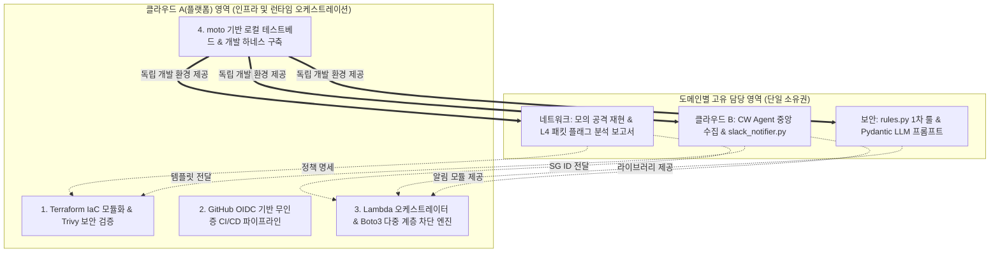

# CloudShield: 프로젝트 종합 개요 및 엔지니어링 성과

## 1. 프로젝트 개요

- **프로젝트명**: CloudShield (클라우드 하이브리드 위협 탐지·자동 대응 및 SecOps 파이프라인)
- **목적**: 클라우드 인프라 내 침해 위협(무차별 대입, 비인가 접근, 스캐닝 등)을 실시간 감지하고, 룰 기반 즉각 차단과 LLM 구조화 출력 기반 심층 분석을 결합하여 격리·대응·보고를 자동화하는 클라우드 침해사고 대응 파이프라인 구축.
- **핵심 아키텍처 특성**:
  - **Terraform 기반 IaC**: 인프라 전체의 코드화 및 재현성 확보를 위한 모듈 설계.
  - **GitHub Actions CI/CD**: 서버리스 애플리케이션 자동 빌드 및 배포 파이프라인.
  - **하이브리드 대응 모델**: 초단위 긴급 대응(WAF/격리 SG)은 룰 엔진이 즉각 수행, 정밀 침해사고 분석 및 리포팅은 LLM 비동기 파이프라인이 전담.
  - **네트워크 심층 가시성**: L3/L4 VPC Flow Logs 분석과 L4 패킷 덤프(tcpdump/Wireshark)를 통한 공격 시그니처 입증.

---

## 2. 직무별 핵심 작업 및 엔지니어링 성과

### [네트워크 담당] — 네트워크 설계, 패킷 분석 및 격리 아키텍처

- **주요 R&R**:
  - Public/Private Subnet 분리, Bastion Host, Route Table 설계 및 네트워크 토폴로지 수립.
  - Nmap, Hydra를 활용한 공격 시뮬레이션 환경 구축 및 트래픽 재현.
  - 공격 인입 시 tcpdump 패킷 덤프 및 Wireshark 기반 L4 핸드셰이크/비정상 플래그 거동 분석 보고서 작성.
  - VPC Flow Logs 활성화 및 비정상 트래픽 식별용 CloudWatch Insights 쿼리 설계.
  - 침해 인스턴스 측면 이동 방지를 위한 **격리 전용 Security Group** 정책 설계.
- **핵심 기술 성과 및 차별성**:
  - 공격 시나리오별 L4 TCP 플래그 및 패킷 레벨(tcpdump/Wireshark) 이상 징후 실증 분석.
  - 클라우드 침해사고 발생 시 횡적 확산을 원천 차단하기 위한 네트워크 격리 아키텍처 수립.

---

### [클라우드 담당 A] — IaC 인프라 프로비저닝 및 DevSecOps CI/CD

- **주요 R&R**:
  - 전체 AWS 리소스(VPC, Subnet, EC2, SG, WAF, Lambda, IAM Role)를 **Terraform IaC** 코드로 모듈화 및 프로비저닝 설계.
  - **GitHub Actions**를 통한 Lambda 함수 및 보안 자동화 코드의 CI/CD 파이프라인 구축 (테스트, 패키징, 자동 배포).
  - AWS WAF IPSet 동적 업데이트 및 침해 인스턴스 Quarantine SG 교체 Boto3 자동화 모듈 구현.
  - 전체 인프라 보안 베이스라인(IAM 최소 권한, 환경변수 시크릿 관리) 총괄.
- **핵심 기술 성과 및 차별성**:
  - 재현 가능한 클라우드 인프라 구성을 위한 Terraform 모듈 설계.
  - 보안 자동화 로직을 GitHub Actions CI/CD 파이프라인과 결합하여 OIDC 무인증 배포 체계 설계.

---

### [클라우드 담당 B] — 중앙 집중형 로깅 및 모니터링 파이프라인

- **주요 R&R**:
  - 타깃 인스턴스(Linux/Nginx) 환경 구축 및 OS 시스템 감사 로그(/var/log/auth.log) 경로 표준화.
  - **AWS CloudWatch Unified Agent** 설치, 구성(`amazon-cloudwatch-agent.json`) 및 로그 인제스트 파이프라인 구축.
  - CloudWatch Logs 구독 필터(Subscription Filter) 설정을 통한 탐지 파이프라인 트리거 연동.
  - Slack Incoming Webhook 기반 실시간 상황 전파용 카드형 메시지 템플릿(Block Kit) 설계 및 전송 모듈 구현.
- **핵심 기술 성과 및 차별성**:
  - 분산 서버 인프라에서 발생하는 시스템 로그를 CloudWatch Unified Agent를 통해 안전하게 중앙화한 실무 로깅 아키텍처 구축.
  - 이벤트 기반 로그 구독 필터와 Slack 연동을 통한 인프라 가시성 및 관제 자동화 달성.

---

### [보안 담당] — 탐지 시그니처 룰 및 LLM 구조화 침해 분석

- **주요 R&R**:
  - 단일/다중 계정 대상 무차별 대입, 비인가 접근 등 이상징후 판별 1차 시그니처 룰(정규식 및 카운팅 임계치) 정립.
  - 탐지된 공격 유형을 글로벌 표준인 **MITRE ATT&CK 프레임워크** 기법과 1:1 매핑.
  - **LLM 구조화 출력(Pydantic)**을 적용하여 환각 없는 표준 침해사고 분석 리포트 생성기 구현.
  - 오탐과 정탐 분류 기준 및 대응 우선순위 정책 명세화.
- **핵심 기술 성과 및 차별성**:
  - MITRE ATT&CK 프레임워크 기반 엔터프라이즈 탐지 규칙 설계.
  - 생성형 AI의 취약점인 비정형 출력을 Pydantic 스키마로 통제하여 프로덕션 파이프라인에 안전하게 통합한 AI SecOps 구현.

---

## 3. 도메인별 단일 소유권 및 역할 분담 원칙

플랫폼 엔지니어링을 주도하되, **각 직무 담당자의 모듈 경계와 단일 소유권을 엄격히 보장**하는 것을 대원칙으로 수립했습니다:

* **단일 소유권 원칙 (Single Ownership)**:
  * 네트워크의 Wireshark 패킷 분석 보고서 및 공격 재현 스크립트는 네트워크 담당의 단독 산출물로 관리.
  * 클라우드 B의 CloudWatch Agent 설정과 Slack 알림 모듈(`slack_notifier.py`)은 클라우드 B의 단독 코드로 관리.
  * 보안 담당의 정규표현식 룰(`rules.py`)과 LLM 프롬프트/Pydantic 모델은 보안 담당의 단독 코드로 관리.
* **클라우드 A(플랫폼 리드)의 역할**:
  * 타 직무의 코드를 직접 수정하지 않고, 각 담당자가 작성한 모듈이 **단 한 줄의 수정 없이 플러그인처럼 결합되어 동작할 수 있는 런타임 엔진, IaC, CI/CD 배관 및 로컬 Mock 하네스**를 제공하는 데 집중.

---

## 4. 파이프라인 아키텍처 채택 배경

* **파이프라인 중심 접근 이유**:
  * 본 프로젝트의 핵심 과제는 인프라, 네트워크 라우팅, L4 패킷 검증, 탐지 시그니처 정립, IAM 접근 제어 등 클라우드 보안 엔지니어링 영역입니다.
  * 웹 애플리케이션 UI 개발에 리소스를 분산하는 대신, 침해 탐지 및 인프라 제어 백본 파이프라인의 완성도와 실시간성(10초 골든타임)에 집중했습니다.
* **관통 파이프라인의 완결성**:
  * 단일 공격 스크립트 실행으로 **"공격 $\rightarrow$ 인제스트 $\rightarrow$ 룰/LLM 판정 $\rightarrow$ WAF/SG/IAM 차단 $\rightarrow$ Slack 알림"**의 전 과정이 라이브로 연동되는 파이프라인을 구축하여, 클라우드 침해사고에 대한 신속한 탐지 및 인프라 자동 통제 능력을 검증합니다.
