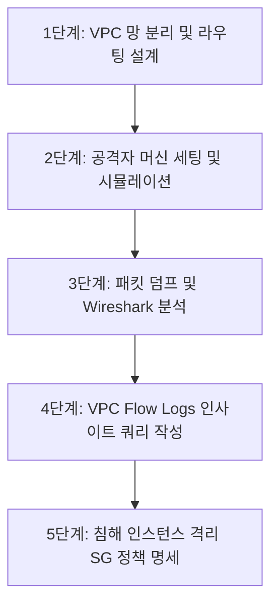

# [직무 가이드 1] 네트워크 담당 — 작업 상세 흐름도

## 1. 개요 및 역할 정의
네트워크 담당은 외부 침입을 가정한 공격 트래픽 시뮬레이션, 패킷 레벨의 분석 데이터 확보, VPC 내부 망 분리 및 침해 인스턴스 격리 정책 수립을 전담한다.

---

## 2. 세부 작업 단계 (Step-by-Step)



### 1단계: VPC 망 분리 및 라우팅 설계
- **내용**:
  - AWS 환경에 Public Subnet(외부 통신용)과 Private Subnet(타깃 서버 보호용)을 구분 설계.
  - 외부 관리 접근을 위한 Bastion Host 구성 및 관리 포트(SSH 22) 인바운드 제한 정책 수립.
- **산출물**:
  - 클라우드 네트워크 구성 토폴로지 다이어그램.
  - 서브넷 대역(CIDR) 및 라우팅 테이블 명세서 (클라우드 A의 Terraform 입력값으로 전달).

### 2단계: 공격자 머신 환경 구성 및 시뮬레이션
- **내용**:
  - 별도 공격자 인스턴스(Kali Linux 또는 기본 Linux) 구축.
  - **SSH Brute Force**: `hydra -l admin -P wordlist.txt <타깃IP> ssh -t 4`
  - **포트 스캐닝**: `nmap -sS -p 20-100 <타깃IP>` (SYN Stealth Scan)
- **산출물**:
  - 공격 재현 스크립트(`attack_simulation.sh`).

### 3단계: 패킷 덤프 및 Wireshark 분석
- **내용**:
  - 타깃 인스턴스 또는 공격 경로 상에서 `tcpdump`를 실행하여 트래픽 캡처.
    ```bash
    sudo tcpdump -i any port 22 -w /tmp/ssh_attack.pcap -c 1000
    ```
  - Wireshark로 `.pcap` 파일을 열어 정상 접속과 Brute Force 공격 시 발생하는 TCP 플래그(SYN, RST) 비율, 접속 주기, 세션 지속 시간 비교 분석.
- **산출물**:
  - 공격 유형별 L4 패킷 이상 징후 분석 보고서 (스크린샷 및 패킷 플로우 다이어그램 포함).

### 4단계: VPC Flow Logs 모니터링 쿼리 작성
- **내용**:
  - 타깃 VPC의 Flow Logs 활성화.
  - CloudWatch Logs Insights에서 대량 REJECT 또는 단시간 다수 패킷을 유발하는 의심 IP를 추출하는 쿼리문 작성.
    ```sql
    fields @timestamp, srcAddr, dstAddr, dstPort, protocol, action
    | filter action = "REJECT" or dstPort = 22
    | stats count() as rejectCount by srcAddr
    | filter rejectCount > 20
    | sort rejectCount desc
    ```
- **산출물**:
  - 네트워크 이상 트래픽 탐지용 쿼리 모음집.

### 5단계: 침해 인스턴스 격리(Quarantine) 정책 명세
- **내용**:
  - 공격에 노출되거나 침해된 EC2가 다른 내부 시스템을 공격하지 못하도록 차단하는 보안 그룹 설계.
  - **Quarantine SG 규칙**: 인바운드 전체 차단(분석용 보안팀 사내 IP만 허용), 아웃바운드 전체 차단.
- **산출물**:
  - 격리 보안 그룹 인/아웃바운드 규칙 명세서 (클라우드 A의 Boto3 자동 교체 로직에 적용).
