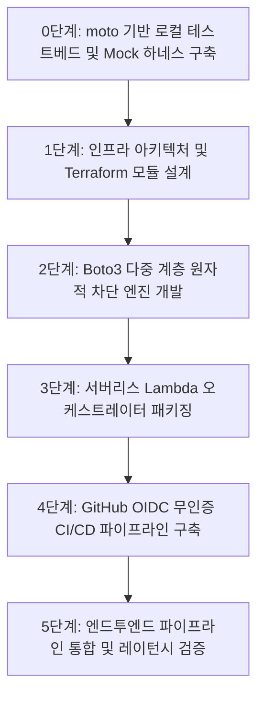

# [직무 가이드 2] 클라우드 담당 A — 작업 상세 흐름도

## 1. 개요 및 역할 정의

* **역할**: 팀의 테크 리드 및 플랫폼 엔지니어.
* **핵심 원칙 (팀원 지분 비침범)**:
  * 비전공자 팀원들이 작성한 모듈(네트워크의 SG 정책, 클라우드 B의 슬랙 알림, 보안의 룰/LLM)의 로직을 침범하지 않고, 팀원들의 코드가 플러그인처럼 꽂혀서 돌아가는 **"런타임 오케스트레이터, IaC, CI/CD 배관, 로컬 Mock 하네스"**에 본인의 엔지니어링 깊이를 집중함.

---

## 2. 세부 작업 단계 (Step-by-Step)

### 0단계: moto 기반 로컬 테스트베드 및 Mock 하네스 구축 (Day 1~2)
- **내용**:
  * 팀원들이 AWS 비용이나 콘솔 접속 없이 로컬에서 코드를 검증할 수 있는 테스트 환경 구축.
  * `src/contracts/`에 Pydantic V2 스키마(`IncidentReport`, CW 이벤트) 동결.
  * `tests/conftest.py`에 `moto` 기반의 가상 WAFv2, EC2, IAM 환경 및 픽스처 완비.
- **산출물**:
  * 공통 계약 스키마 및 로컬 Mock 테스트 하네스.

### 1단계: 인프라 아키텍처 및 Terraform 모듈 설계
- **내용**:
  - 팀원들의 요구사항(네트워크의 VPC/SG, 클라우드 B의 CloudWatch Logs, 보안의 WAF/IAM)을 통합하여 Terraform 코드로 작성.
  - 디렉토리 구조 모듈화:
    - `modules/network`: VPC, Subnets, Route Tables, Internet Gateway.
    - `modules/compute`: Target EC2, Bastion Host, Security Groups (Normal & Quarantine).
    - `modules/security`: AWS WAF WebACL, IPSet, IAM Roles & Policies.
    - `modules/monitoring`: CloudWatch Log Group, Metric Filters, Subscription Filters.
    - `modules/serverless`: Lambda Function, EventBridge Rule.
- **산출물**:
  - 재사용 가능한 Terraform 모듈 코드베이스 (`*.tf`).

### 2단계: Boto3 다중 계층(Multi-Layer) 원자적 차단 엔진 개발
- **내용**:
  - 보안 담당자의 분석 결과(`IncidentReport`)를 인자로 받아 실제 AWS 리소스를 변경하는 `remediation.py` 구현.
  - **L4 차단**: 침해 EC2의 기존 SG를 네트워크 담당자가 명세한 'Quarantine SG'로 즉시 교체(`ec2.modify_instance_attribute`).
  - **L7 차단**: 공격자 IP를 AWS WAF IPSet에 추가(`wafv2.update_ip_set`, CIDR `/32` 검증 포함).
  - **Identity 차단**: 타깃 서버에 연결된 IAM 임시 자격증명 무효화(`iam.revoke_security_tokens`) 연동.
  - 트랜잭션 예외 처리: 각 차단 단계 실패 시 에러 로깅 및 안전한 폴백(Fallback) 보장.
- **산출물**:
  - 다중 계층 리소스 제어 모듈 (`remediation.py`).

### 3단계: 서버리스 Lambda 오케스트레이터 통합 패키징
- **내용**:
  - CloudWatch Logs Subscription Filter 페이로드 수신 및 Base64/Gzip 디코딩 (클라우드 B 규격 연동).
  - 보안 담당자의 `rules.py` 및 `llm_analyzer.py` 호출.
  - 위험도 HIGH 판정 시 2단계의 `remediation.py` 원자적 호출.
  - 최종 조치 결과를 클라우드 B의 `slack_notifier.py`로 전달하여 알림 발송.
- **산출물**:
  - Lambda 메인 엔트리포인트 (`lambda_function.py`).

### 4단계: GitHub OIDC 무인증 CI/CD 파이프라인 구축
- **내용**:
  - `.github/workflows/deploy.yml` 파일 작성.
  - 보안을 위해 정적 AWS Access Key 하드코딩을 배제하고, **GitHub Actions OIDC 페더레이션**을 통한 IAM Role 동적 Assume 구조 적용.
  - PR 생성 시 `ruff check`, `pytest`, `trivy config`(IaC 보안 취약점 진단) 자동 실행.
  - Main 머지 시 Lambda 의존성 패키징 및 무중단 자동 갱신.
- **산출물**:
  - DevSecOps 자동 배포 워크플로우.

### 5단계: 통합 테스트 및 인프라 배포
- **내용**:
  - 전체 파이프라인의 엔드투엔드(E2E) 동작 검증.
  - 모의 공격 실행 후 3~5초 이내에 WAF/SG 차단 및 Slack 알림 수신 여부 레이턴시 측정.
- **산출물**:
  - E2E 검증 보고서 및 성능 레이턴시 측정 지표.
