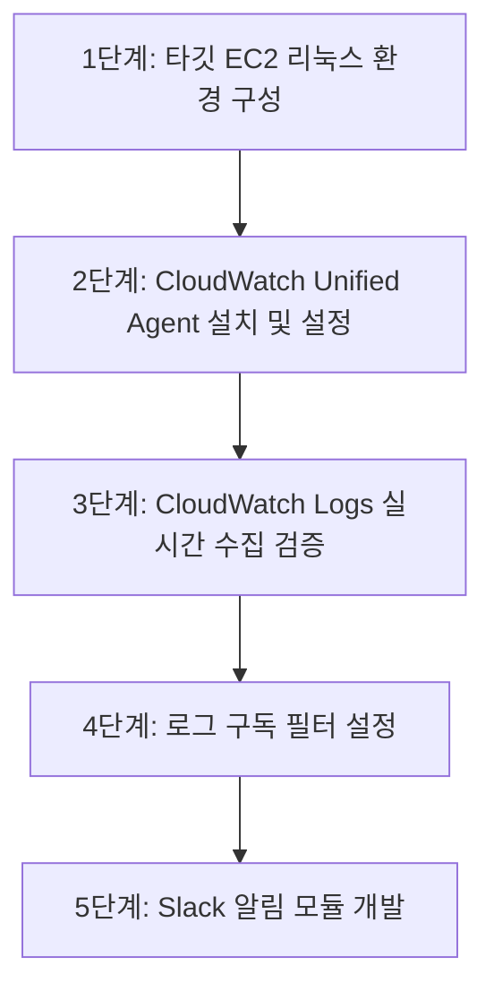

# [직무 가이드 3] 클라우드 담당 B — 작업 상세 흐름도

## 1. 개요 및 역할 정의
클라우드 담당 B는 타깃 인스턴스의 환경을 안정적으로 구성하고, OS 및 서비스 로그를 AWS CloudWatch Logs로 실시간 인제스트하는 에이전트 파이프라인과 관리자용 Slack 알림 모듈을 구축한다.

---

## 2. 세부 작업 단계 (Step-by-Step)



### 1단계: 타깃 EC2 리눅스 환경 구성
- **내용**:
  - Ubuntu Linux 인스턴스에 Nginx 웹 서버 설치 및 테스트 페이지 구동.
  - SSH 접근 포트(22) 및 웹 포트(80) 활성화.
  - SSH 접속 실패 로그가 기록되는 경로(`/var/log/auth.log`)와 Nginx 접근/에러 로그 경로(`/var/log/nginx/access.log`) 확인.
- **산출물**:
  - 인스턴스 초기화 스크립트(`init_target_server.sh`).

### 2단계: CloudWatch Unified Agent 설치 및 설정
- **내용**:
  - 타깃 인스턴스에 `amazon-cloudwatch-agent` 패키지 설치.
  - `amazon-cloudwatch-agent.json` 설정 파일 작성:
    ```json
    {
      "logs": {
        "logs_collected": {
          "files": {
            "collect_list": [
              {
                "file_path": "/var/log/auth.log",
                "log_group_name": "/cloudshield/target/auth-log",
                "log_stream_name": "{instance_id}",
                "timestamp_format": "%b %d %H:%M:%S"
              }
            ]
          }
        }
      }
    }
    ```
  - 타깃 인스턴스에 `CloudWatchAgentServerPolicy` IAM Role 연결 후 에이전트 서비스 시작.
- **산출물**:
  - CloudWatch 에이전트 구성 템플릿 파일.

### 3단계: CloudWatch Logs 수집 실시간 검증
- **내용**:
  - 의도적으로 SSH 비밀번호를 틀리게 입력하여 로컬 `/var/log/auth.log`에 로그 생성.
  - AWS CloudWatch 콘솔의 `/cloudshield/target/auth-log` 로그 그룹에 해당 로그가 3~5초 이내에 정상 반영되는지 모니터링.
- **산출물**:
  - 로그 인제스트 확인 스크린샷 및 전송 지연 시간 기록표.

### 4단계: 로그 구독 필터 설정
- **내용**:
  - CloudWatch Logs에 수집되는 로그 중 의심 키워드가 포함된 라인만 필터링하여 Lambda로 넘기는 구독 규칙 설정.
  - **필터 패턴**: `[mon, day, timestamp, host, process, msg = "*Failed password*", ...]`
  - 대상을 클라우드 A가 배포한 분석용 Lambda 함수로 지정.
- **산출물**:
  - 구독 필터 정의 파라미터 (클라우드 A의 Terraform 모듈에 반영).

### 5단계: Slack Webhook 알림 모듈 개발
- **내용**:
  - Slack API에서 Incoming Webhook 생성.
  - 침해 분석 결과(보안 담당의 JSON)를 수신하여 Slack Block Kit 포맷으로 변환 및 발송하는 Python 함수(`slack_notifier.py`) 작성.
  - **메시지 구성**:
    - 경보 헤더 (위험도: HIGH / 공격 유형: 무차별 대입 공격)
    - 공격 출발지 IP 및 대상 계정 목록
    - 조치 결과 (AWS WAF 차단 완료, 격리 SG 적용 여부)
    - 사후 권고 조치 내역
- **산출물**:
  - Slack 발송 모듈 코드(`slack_notifier.py`) 및 알림 카드 프리뷰.
