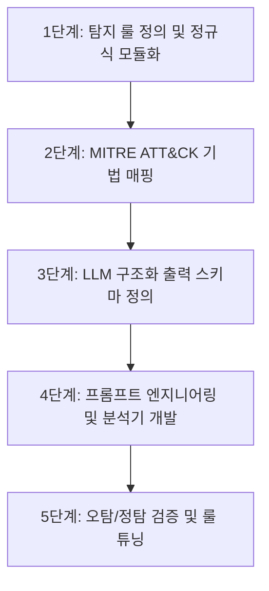

# [직무 가이드 4] 보안 담당 — 작업 상세 흐름도

## 1. 개요 및 역할 정의
보안 담당은 인입된 로그 데이터에서 1차 이상징후를 판별하는 결정론적 룰(정규식/임계치)을 정의하고, 이를 글로벌 보안 프레임워크인 MITRE ATT&CK과 매핑하며, LLM 구조화 출력을 활용해 표준화된 JSON 침해사고 분석 결과를 도출한다.

---

## 2. 세부 작업 단계 (Step-by-Step)



### 1단계: 탐지 룰 정의 및 정규식 모듈화
- **내용**:
  - 이미 검증된 브라우저용 로직을 순수 Python 모듈(`rules.py`)로 이식.
  - **룰 1: 단일 계정 무차별 대입 공격** (동일 IP에서 동일 계정 대상 실패 5회 이상).
  - **룰 2: 다중 계정 패스워드 스프레잉** (동일 IP에서 2개 이상의 서로 다른 계정 실패).
  - **룰 3: 비인가 권한 접근** (DENIED, UNAUTHORIZED 키워드 3회 이상).
- **산출물**:
  - 룰 기반 1차 탐지 함수(`rules.py`).

### 2단계: MITRE ATT&CK 기법 매핑
- **내용**:
  - 각 탐지 룰을 글로벌 엔터프라이즈 보안 매트릭스에 1:1로 매핑하여 보고서의 객관성 확보.
    - SSH 패스워드 대입 $\rightarrow$ **T1110.001 (Brute Force: Password Guessing)**
    - 다중 계정 찔러보기 $\rightarrow$ **T1110.003 (Brute Force: Password Spraying)**
    - Nmap 포트 스캔 $\rightarrow$ **T1046 (Network Service Discovery)**
- **산출물**:
  - 위협 매핑 테이블 명세서.

### 3단계: LLM 구조화 출력 스키마 정의 (Pydantic)
- **내용**:
  - Pydantic V2 기반 구조화 출력 기법을 적용하여, LLM 응답이 정해진 규격의 JSON 객체로 반환되도록 모델 선언.
    ```python
    from pydantic import BaseModel, Field
    from typing import List


    class IncidentReport(BaseModel):
        attack_type: str = Field(description="공격 유형 (예: SSH Brute Force)")
        mitre_id: str = Field(description="MITRE ATT&CK 기법 ID (예: T1110.001)")
        risk_level: str = Field(description="위험도 (HIGH, MEDIUM, LOW)")
        source_ip: str = Field(description="공격 출발지 IP")
        target_accounts: List[str] = Field(description="공격 대상 계정 목록")
        summary_ko: str = Field(description="침해 상황 한글 요약 (2~3문장)")
        action_required: str = Field(description="조치 요구사항 (BLOCK_IP, QUARANTINE, MONITOR)")
        recommendations: List[str] = Field(description="관리자 권고 보안 조치")
    ```
- **산출물**:
  - 데이터 모델 정의 코드(`src/contracts/incident.py`).

### 4단계: 프롬프트 엔지니어링 및 분석기 개발
- **내용**:
  - 시스템 프롬프트에 보안 관제 전문가 역할을 부여하고 Few-shot 예시를 추가.
  - OpenAI/Gemini SDK의 Structured Output 기능을 호출하여 로그 텍스트를 `IncidentReport` 객체로 변환하는 단일 함수 구현.
    ```python
    def analyze_security_incident(raw_log: str) -> IncidentReport:
        # LLM API 호출 (response_format=IncidentReport 적용)
        ...
        return incident_data
    ```
- **산출물**:
  - LLM 분석기 스크립트(`llm_analyzer.py`).

### 5단계: 오탐/정탐 검증 및 룰 튜닝
- **내용**:
  - 정상적인 관리자 로그인 로그, 1~2회 오타 발생 로그, 실제 대량 공격 로그를 주입하여 테스트.
  - 정상 접속 로그가 들어왔을 때 오탐으로 차단되지 않고 `risk_level: "LOW"`로 평가되는지 임계치 튜닝.
- **산출물**:
  - 탐지 정확도 및 오탐 검증 테스트 리포트.
