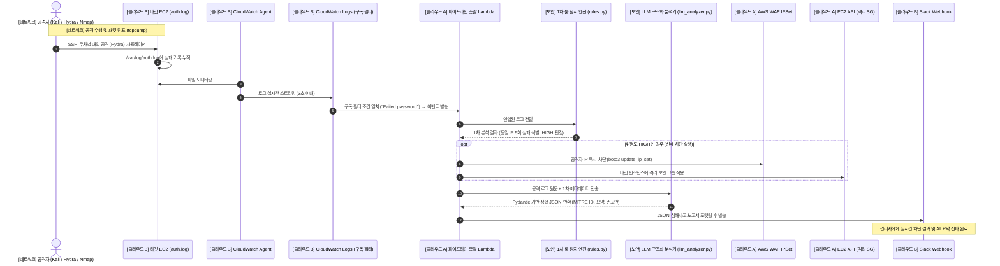

# CloudShield: 통합 엔드투엔드 파이프라인 명세서

## 1. 종합 파이프라인 아키텍처 다이어그램



---

## 2. 데이터 흐름 및 직무 간 인터페이스 규격

### [구간 1] 네트워크 $\rightarrow$ 클라우드 B (공격 $\rightarrow$ 로깅)
- **동작**: 네트워크 담당이 타깃 IP로 공격 패킷을 전송하면, 타깃 서버의 Linux 커널이 `/var/log/auth.log`에 로그 생성.
- **데이터 예시**:
  ```text
  Sep 03 15:30:12 ip-10-0-1-50 sshd[1234]: Failed password for admin from 198.51.100.24 port 43210 ssh2
  Sep 03 15:30:14 ip-10-0-1-50 sshd[1235]: Failed password for admin from 198.51.100.24 port 43212 ssh2
  ```

### [구간 2] 클라우드 B $\rightarrow$ 클라우드 A (로깅 $\rightarrow$ Lambda 트리거)
- **동작**: CloudWatch Logs의 Subscription Filter가 키워드 매칭 시 Lambda로 Base64 인코딩 및 Gzip 압축된 JSON 이벤트 페이로드 전달.
- **데이터 규격**: `event['awslogs']['data']` (Lambda에서 디코딩 후 텍스트 추출).

### [구간 3] 클라우드 A $\leftrightarrow$ 보안 (Lambda $\leftrightarrow$ 탐지 및 LLM 분석)
- **동작**: Lambda가 보안 담당자의 `rules.py`와 `llm_analyzer.py`를 라이브러리 형태로 직접 호출.
- **인터페이스 (보안 담당자가 제공하는 최종 반환값)**:
  ```json
  {
    "attack_type": "SSH Brute Force",
    "mitre_id": "T1110.001",
    "risk_level": "HIGH",
    "source_ip": "198.51.100.24",
    "target_accounts": ["admin"],
    "summary_ko": "출발지 IP 198.51.100.24로부터 짧은 시간 내 5회 이상의 비정상 SSH 패스워드 인증 실패가 탐지되어 공격으로 판정함.",
    "action_required": "BLOCK_AND_QUARANTINE",
    "recommendations": [
      "WAF IPSet을 통한 외부 인바운드 차단",
      "침해 인스턴스 격리 SG 적용",
      "SSH 포트 변경 및 공개키 기반 인증으로 전환"
    ]
  }
  ```

### [구간 4] 클라우드 A $\rightarrow$ AWS 인프라 (즉각 차단 및 격리)
- **동작**: `action_required == "BLOCK_AND_QUARANTINE"` 조건 만족 시:
  1. `boto3.client('wafv2').update_ip_set(...)` $\rightarrow$ 공격자 IP WAF 차단.
  2. `boto3.client('ec2').modify_instance_attribute(Groups=['<Quarantine_SG_ID>'])` $\rightarrow$ 침해 인스턴스 네트워크 격리.

### [구간 5] 클라우드 A $\rightarrow$ 클라우드 B (최종 결과 $\rightarrow$ Slack 알림)
- **동작**: 클라우드 B가 작성한 `slack_notifier.py`에 위 보안 JSON 데이터와 차단 성공 여부(`waf_blocked: true`, `quarantine_applied: true`)를 인자로 넘겨 Slack으로 웹훅 전송.

---

## 3. 엔드투엔드 검증 시나리오 체크리스트

| 검증 단계 | 검증 항목 | 담당자 | 합격 기준 |
| :--- :--- | :--- | :---: | :--- |
| **1** | 공격 트래픽 발생 및 패킷 덤프 | 네트워크 | 타깃 서버에 `.pcap` 파일 생성 및 Hydra 공격 로그 생성 확인 |
| **2** | CloudWatch Logs 실시간 인제스트 | 클라우드 B | 공격 발생 후 5초 이내 CloudWatch 로그 그룹에 로그 적재 |
| **3** | Lambda 자동 트리거 및 1차 룰 탐지 | 클라우드 A, 보안 | CloudWatch 구독 필터를 통해 Lambda가 호출되고 룰에 의해 HIGH 분류 |
| **4** | WAF IP 차단 및 격리 SG 적용 | 클라우드 A | 공격자 IP가 WAF IPSet에 추가되고, 타깃 EC2의 SG가 격리용으로 변경됨 |
| **5** | LLM 구조화 침해 분석 리포트 생성 | 보안 | 환각 없이 Pydantic 스키마 규격을 100% 준수한 JSON 분석 결과 도출 |
| **6** | Slack 실시간 침해 카드 수신 | 클라우드 B | Slack 채널에 공격 요약, MITRE ID, 조치 내역이 포함된 카드 메시지 도착 |
| **7** | CI/CD 파이프라인 검증 | 클라우드 A | 코드 수정 후 GitHub Push 시 Lambda 및 관련 코드가 자동 빌드/배포됨 |
