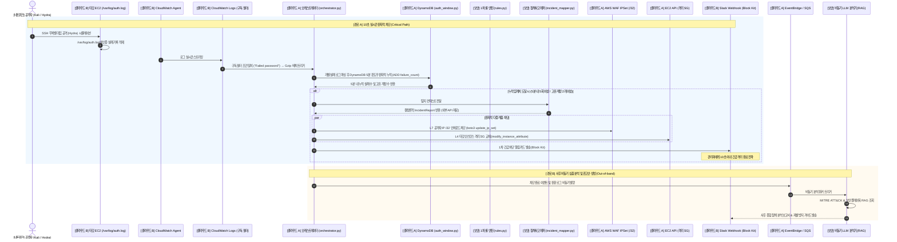

# CloudShield: 통합 엔드투엔드 파이프라인 명세서

## 1. 종합 파이프라인 아키텍처 다이어그램

CloudShield는 **"10초 실시간 원자적 차단(Critical Path)"**과 **"사후 심층 분석 및 지능형 리포팅(Out-of-band LLM)"**을 물리적·논리적으로 분리한 이원화 하이브리드 파이프라인을 채택합니다.



---

## 2. 데이터 흐름 및 직무 간 인터페이스 규격

### [구간 1] 네트워크 $\rightarrow$ 클라우드 B (공격 $\rightarrow$ 로깅)
- **동작**: 네트워크 담당이 타깃 IP로 공격 패킷을 전송하면, 타깃 서버의 Linux 커널이 `/var/log/auth.log`에 로그 생성.
- **데이터 예시**:
  ```text
  Sep 03 15:30:12 ip-10-0-1-50 sshd[1234]: Failed password for admin from 198.51.100.24 port 43210 ssh2
  Sep 03 15:30:14 ip-10-0-1-50 sshd[1235]: Failed password for admin from 198.51.100.24 port 43212 ssh2
  ```

### [구간 2] 클라우드 B $\rightarrow$ 클라우드 A (로깅 $\rightarrow$ Lambda 트리거)
- **동작**: CloudWatch Logs의 Subscription Filter가 키워드 매칭 시 Lambda로 Base64 인코딩 및 Gzip 압축된 JSON 이벤트 페이로드 전달.
- **데이터 규격**: `event['awslogs']['data']` (Lambda에서 Gzip 해제 후 텍스트 추출).

### [구간 3] 클라우드 A $\leftrightarrow$ 보안 (Lambda $\leftrightarrow$ 윈도우 누적 및 결정론적 IncidentReport 승격)
- **동작**: 
  1. Lambda 오케스트레이터가 인입된 로그 배치를 파싱하고, CloudWatch의 분할 배치 전송(예: 3건 + 2건) 시에도 브루트포스 횟수가 누락되지 않도록 DynamoDB 원자적 카운터(`auth_window.py`)로 5분 슬라이딩 윈도우를 갱신.
  2. 5분 내 임계치(5회 실패 또는 2개 이상 고유 계정) 도달 시, 보안 담당자의 `incident_mapper.py`를 호출하여 10초 관통 대응을 위한 표준 `IncidentReport` 객체 획득 (외부 네트워크/LLM API I/O 제로).
- **인터페이스 (보안 담당자가 제공하는 IncidentReport 규격)**:
  ```json
  {
    "incident_id": "INC-SIG-SSH-AUTH-001",
    "attack_type": "SSH Brute Force",
    "mitre_id": "T1110.001",
    "risk_level": "HIGH",
    "source_ip": "198.51.100.24",
    "target_identifier": "i-0abcd1234ef567890",
    "target_accounts": ["admin"],
    "summary_ko": "동일 IP(198.51.100.24) 및 계정(admin)에 대한 5분 내 5회 이상 무차별 대입 공격이 탐지되었습니다.",
    "action_required": "BLOCK_AND_QUARANTINE",
    "recommendations": [
      "L4 보안 그룹 전면 격리 상태 유지",
      "WAF IPSet /32 단일 호스트 차단 등록 확인"
    ]
  }
  ```

### [구간 4] 클라우드 A $\rightarrow$ AWS 인프라 (즉각 원자적 차단 및 격리)
- **동작**: `action_required == "BLOCK_AND_QUARANTINE"` 조건 만족 시:
  1. `boto3.client('wafv2').update_ip_set(...)` $\rightarrow$ 공격자 IP /32 WAF 원자적 등록 차단 (L7 방어).
  2. `boto3.client('ec2').modify_instance_attribute(Groups=['<Quarantine_SG_ID>'])` $\rightarrow$ 침해 인스턴스 네트워크 격리 (L4 방어).
  *(참고: SSH 공격 시나리오는 Linux OS 계정 침해이므로 L4 SG 및 L7 WAF 차단에 집중하며, Identity IAM 세션 무효화는 AWS 자격증명 탈취 시나리오로 분리)*

### [구간 5] 클라우드 A $\rightarrow$ 클라우드 B (실시간 상황 전파 $\rightarrow$ Slack 알림)
- **동작**: 클라우드 B가 작성한 `slack_notifier.py`에 `IncidentReport`와 차단 집행 결과(`waf_blocked: true`, `quarantine_applied: true`)를 전달하여 Slack Block Kit 카드 발송.

### [구간 6] 클라우드 A $\rightarrow$ 보안 (사후 비동기 심층 분석 연계 - Out-of-band)
- **동작**: 실시간 차단 성공 후, 이벤트 큐(EventBridge/SQS)를 통해 비동기 워커로 인시던트 컨텍스트 전달 $\rightarrow$ 보안 담당의 LLM RAG 파이프라인이 관리자 심층 분석 보고서를 작성하여 Slack 사후 스레드 등록.

---

## 3. 엔드투엔드 검증 시나리오 체크리스트

| 검증 단계 | 검증 항목 | 담당자 | 합격 기준 |
| :--- :--- | :--- | :---: | :--- |
| **1** | 공격 트래픽 발생 및 패킷 덤프 | 네트워크 | 타깃 서버에 `.pcap` 파일 생성 및 Hydra 공격 로그 생성 확인 |
| **2** | CloudWatch Logs 실시간 인제스트 | 클라우드 B | 공격 발생 후 5초 이내 CloudWatch 로그 그룹에 로그 적재 |
| **3** | Lambda 자동 트리거 및 1차 룰 탐지 | 클라우드 A, 보안 | CloudWatch 구독 필터를 통해 Lambda가 호출되고 룰에 의해 HIGH 분류 |
| **4** | WAF IP 차단 및 격리 SG 적용 | 클라우드 A | 공격자 IP가 WAF IPSet에 추가되고, 타깃 EC2의 SG가 격리용으로 변경됨 |
| **5** | 결정론적 IncidentReport 승격 | 보안 | 외부 LLM 호출 없이 10초 이내에 Pydantic 계약 규격 100% 만족 객체 생성 |
| **6** | Slack 실시간 침해 카드 수신 | 클라우드 B | Slack 채널에 공격 요약, MITRE ID, 조치 내역이 포함된 카드 메시지 도착 |
| **7** | 사후 비동기 LLM 심층 분석 (확장) | 보안 | 차단 완료 후 비동기로 RAG 기반 종합 침해 보고서 및 재발 방지 권고안 도출 |
| **8** | CI/CD 파이프라인 검증 | 클라우드 A | 코드 수정 후 GitHub Push 시 Lambda 및 관련 코드가 자동 빌드/배포됨 |
