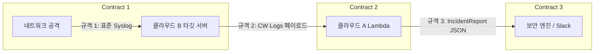

# CloudShield: 직무 간 인터페이스 데이터 규격(Contract) 및 Mocking 명세서

## 1. 개요 및 목적

- **목적**: 인프라 의존성으로 인해 개발이 직렬화(앞 사람이 끝나야 뒷 사람이 시작)되는 병목을 원천 차단.
- **원칙**: 4개 직무는 아래 정의된 **3대 데이터 규격**을 기준으로 각자 로컬/독립 환경에서 모킹(Mocking) 개발을 진행하며, 통합 시에는 레고 블록처럼 결합한다.

---

## 2. 3대 핵심 인터페이스 규격 (Data Contracts)



---

### [규격 1] 네트워크 $\rightarrow$ 클라우드 B: 표준 리눅스 Syslog 규격

네트워크 담당자가 공격을 가했을 때, 타깃 서버의 `/var/log/auth.log`에 반드시 남아야 하는 문자열 포맷.

- **포맷**: `<월> <일> <시:분:초> <호스트명> sshd[<PID>]: Failed password for <invalid user?> <계정명> from <출발지IP> port <포트> ssh2`
- **실제 데이터 예시 (Mock Data)**:
  ```text
  Sep 03 14:20:01 target-ec2 sshd[12341]: Failed password for invalid user admin from 198.51.100.50 port 49152 ssh2
  Sep 03 14:20:02 target-ec2 sshd[12342]: Failed password for invalid user admin from 198.51.100.50 port 49153 ssh2
  Sep 03 14:20:03 target-ec2 sshd[12343]: Failed password for root from 198.51.100.50 port 49154 ssh2
  Sep 03 14:20:04 target-ec2 sshd[12344]: Failed password for root from 198.51.100.50 port 49155 ssh2
  Sep 03 14:20:05 target-ec2 sshd[12345]: Failed password for guest from 198.51.100.50 port 49156 ssh2
  ```
- **독립 개발 활용법**:
  - **보안 담당**: 이 텍스트 5줄을 파일(`mock_auth.log`)로 저장해두고 룰 탐지 및 LLM 분석 코드 작성.
  - **클라우드 B**: EC2에서 `cat mock_auth.log >> /var/log/auth.log` 명령어로 CloudWatch 전송 테스트.

---

### [규격 2] 클라우드 B $\rightarrow$ 클라우드 A: CloudWatch Logs 이벤트 규격

CloudWatch Logs Subscription Filter가 분석 Lambda 함수를 호출할 때 전달하는 AWS 표준 페이로드.

- **형태**: Base64 인코딩 및 gzip 압축된 JSON 객체.
- **디코딩 후 실제 내부 JSON 구조**:
  ```json
  {
    "messageType": "DATA_MESSAGE",
    "owner": "123456789012",
    "logGroup": "/cloudshield/target/auth-log",
    "logStream": "i-0abcd1234ef567890",
    "subscriptionFilters": ["CloudShield-FailedPassword-Filter"],
    "logEvents": [
      {
        "id": "382910293810293810293810293810293810",
        "timestamp": 1725344405000,
        "message": "Sep 03 14:20:05 target-ec2 sshd[12345]: Failed password for guest from 198.51.100.50 port 49156 ssh2"
      }
    ]
  }
  ```
- **독립 개발 활용법**:
  - **클라우드 A**: 실제 AWS 연결 없이도, 이 JSON을 파싱하는 디코딩 함수를 로컬에서 즉시 단위 테스트 가능.

---

### [규격 3] 보안 $\rightarrow$ 클라우드 A & B: 최종 침해사고 분석 객체 (`IncidentReport`)

**프로젝트 전체의 핵심 인터페이스 규격.**  
보안 담당자의 룰 승격기(`incident_mapper.py`의 `analyze_incident()`)가 반환하고, 클라우드 A는 이를 기반으로 L4/L7 차단을 집행하며, 클라우드 B는 이를 기반으로 Slack 알림 카드를 구성함.

- **Pydantic V2 불변 스키마 (`src/contracts/incident.py`)**:
  ```python
  from pydantic import BaseModel, ConfigDict, Field


  class IncidentReport(BaseModel):
      model_config = ConfigDict(frozen=True, extra="forbid")

      incident_id: str = Field(description="사건 고유 식별자 (예: INC-SIG-SSH-AUTH-001)")
      attack_type: str = Field(description="공격 유형 (예: SSH Brute Force, SSH Password Spraying)")
      mitre_id: str = Field(description="MITRE ATT&CK 기법 ID (예: T1110.001)")
      risk_level: Literal["HIGH", "MEDIUM", "LOW"] = Field(description="위험도 판정")
      source_ip: str = Field(description="공격자 IPv4 주소")
      target_identifier: str = Field(description="공격 대상 리소스 식별자 (예: EC2 Instance ID)")
      target_accounts: tuple[str, ...] = Field(description="공격 대상 계정 튜플")
      summary_ko: str = Field(description="결정론적 매퍼 또는 LLM이 생성한 상황 요약문")
      action_required: Literal[
          "BLOCK_AND_QUARANTINE",
          "BLOCK_WAF",
          "BLOCK_IP_ONLY",
          "QUARANTINE_EC2",
          "REVOKE_IAM_SESSION",
          "ALERT_ONLY",
          "NONE",
      ] = Field(description="필수 인프라 대응 조치 지침")
      recommendations: tuple[str, ...] = Field(description="관리자 권고 조치 목록 튜플")
  ```

- **실제 데이터 예시 (Mock Data)**:
  ```json
  {
    "incident_id": "INC-SIG-SSH-AUTH-001",
    "attack_type": "SSH Brute Force",
    "mitre_id": "T1110.001",
    "risk_level": "HIGH",
    "source_ip": "198.51.100.50",
    "target_identifier": "i-0abcd1234ef567890",
    "target_accounts": ["admin"],
    "summary_ko": "동일 IP(198.51.100.50) 및 계정(admin)에 대한 5분 내 5회 이상 무차별 대입 공격이 탐지되었습니다.",
    "action_required": "BLOCK_AND_QUARANTINE",
    "recommendations": [
      "L4 보안 그룹 전면 격리 상태 유지",
      "WAF IPSet /32 단일 호스트 차단 등록 확인"
    ]
  }
  ```

---

### [규격 4] 클라우드 A 분산 상태 관리: DynamoDB 5분 슬라이딩 윈도우 스키마

CloudWatch Logs의 분할 배치 인입 시에도 5분 내 공격 횟수를 안전하게 보존하기 위한 원자적 카운터 테이블 명세.

- **테이블명**: `CloudShield-AuthFailure-Window`
- **파티션 키 (Hash Key)**: `target_key` (String, 형식: `ip:<source_ip>#user:<username>`)
- **속성 명세**:
  - `failure_count` (Number): 5분 슬라이딩 윈도우 내 누적 실패 횟수 (`ADD failure_count :inc`)
  - `usernames` (StringSet): 공격자가 시도한 고유 계정 집합 (스프레잉 판별용)
  - `expire_at` (Number): 윈도우 만료 Epoch Unix Timestamp (TTL 기준 초 단위)
  - `quarantined` (Boolean): 차단 조치 집행 완료 여부 (중복 차단 억제 멱등 플래그)

---

### [규격 5] 클라우드 A $\rightarrow$ 클라우드 B: 다중 계층 차단 결과 모델 (`RemediationResult`)

차단 엔진(`remediation.py`)이 L4 격리 및 L7 차단을 실행한 후, Slack 알림 모듈(`slack_notifier.py`)에 전달하는 TypedDict 규격.

```python
class RemediationResult(TypedDict):
    waf_blocked: bool  # L7 AWS WAF IPSet 등록 성공 여부
    quarantine_applied: bool  # L4 EC2 Quarantine SG 교체 성공 여부
    iam_revoked: bool  # Identity IAM 세션 무효화 성공 여부 (현재 False 기본값)
```

---

## 3. 직무별 Mocking 개발 및 결합 가이드

| 직무 | 로컬 개발 및 단위 검증 시 사용하는 도구 및 Mock 객체 |
| :--- | :--- |
| **네트워크** | Docker 격리 sshd 컨테이너 및 Hydra 모의 공격 스크립트(`hydra_ssh_lab.sh`), `tcpdump` 캡처 분석 |
| **클라우드 B** | `mock_cw_event.json` 디코딩 단위 검증, `IncidentReport` Mock JSON을 통한 Slack Block Kit 전송 검증 |
| **보안** | `mock_auth.log`를 파싱하여 순수 룰 엔진(`rules.py`) 및 결정론적 `IncidentReport` 매퍼(`incident_mapper.py`) 검증 |
| **클라우드 A** | `moto` 기반 가상 AWS(EC2, WAF, DynamoDB) 환경에서 윈도우 누적(`auth_window.py`) 및 복합 차단(`remediation.py`) 검증 |

인터페이스 규격이 명문화되어 있으므로, 4개 도메인이 로컬에서 독립적으로 단위 테스트를 통과한 후 통합 시 충돌 없이 결합됩니다.
