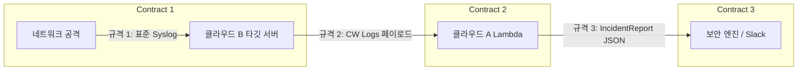

# CloudShield: 직무 간 인터페이스 데이터 규격(Contract) 및 Mocking 명세서

## 1. 개요 및 목적

- **목적**: 인프라 의존성으로 인해 개발이 직렬화(앞 사람이 끝나야 뒷 사람이 시작)되는 병목을 원천 차단.
- **원칙**: 4개 직무는 아래 정의된 **3대 데이터 규격**을 기준으로 각자 로컬/독립 환경에서 모킹(Mocking) 개발을 진행하며, 통합 시에는 레고 블록처럼 결합한다.

---

## 2. 3대 핵심 인터페이스 규격 (Data Contracts)



---

### [규격 1] 네트워크 $\rightarrow$ 클라우드 B: 표준 리눅스 Syslog 규격

네트워크 담당자가 공격을 가했을 때, 타깃 서버의 `/var/log/auth.log`에 반드시 남아야 하는 문자열 포맷.

- **포맷**: `<월> <일> <시:분:초> <호스트명> sshd[<PID>]: Failed password for <invalid user?> <계정명> from <출발지IP> port <포트> ssh2`
- **실제 데이터 예시 (Mock Data)**:
  ```text
  Sep 03 14:20:01 target-ec2 sshd[12341]: Failed password for invalid user admin from 198.51.100.50 port 49152 ssh2
  Sep 03 14:20:02 target-ec2 sshd[12342]: Failed password for invalid user admin from 198.51.100.50 port 49153 ssh2
  Sep 03 14:20:03 target-ec2 sshd[12343]: Failed password for root from 198.51.100.50 port 49154 ssh2
  Sep 03 14:20:04 target-ec2 sshd[12344]: Failed password for root from 198.51.100.50 port 49155 ssh2
  Sep 03 14:20:05 target-ec2 sshd[12345]: Failed password for guest from 198.51.100.50 port 49156 ssh2
  ```
- **독립 개발 활용법**:
  - **보안 담당**: 이 텍스트 5줄을 파일(`mock_auth.log`)로 저장해두고 룰 탐지 및 LLM 분석 코드 작성.
  - **클라우드 B**: EC2에서 `cat mock_auth.log >> /var/log/auth.log` 명령어로 CloudWatch 전송 테스트.

---

### [규격 2] 클라우드 B $\rightarrow$ 클라우드 A: CloudWatch Logs 이벤트 규격

CloudWatch Logs Subscription Filter가 분석 Lambda 함수를 호출할 때 전달하는 AWS 표준 페이로드.

- **형태**: Base64 인코딩 및 gzip 압축된 JSON 객체.
- **디코딩 후 실제 내부 JSON 구조**:
  ```json
  {
    "messageType": "DATA_MESSAGE",
    "owner": "123456789012",
    "logGroup": "/cloudshield/target/auth-log",
    "logStream": "i-0abcd1234ef567890",
    "subscriptionFilters": ["CloudShield-FailedPassword-Filter"],
    "logEvents": [
      {
        "id": "382910293810293810293810293810293810",
        "timestamp": 1725344405000,
        "message": "Sep 03 14:20:05 target-ec2 sshd[12345]: Failed password for guest from 198.51.100.50 port 49156 ssh2"
      }
    ]
  }
  ```
- **독립 개발 활용법**:
  - **클라우드 A**: 실제 AWS 연결 없이도, 이 JSON을 파싱하는 디코딩 함수를 로컬에서 즉시 단위 테스트 가능.

---

### [규격 3] 보안 $\rightarrow$ 클라우드 A & B: 최종 침해사고 분석 객체 (`IncidentReport`)

**★ 프로젝트 전체에서 가장 핵심이 되는 표준 규격.**  
보안 담당자의 분석 함수(`analyze_incident()`)가 리턴하고, 클라우드 A는 이를 보고 차단하며, 클라우드 B는 이를 보고 Slack 메시지를 만듦.

- **Pydantic 스키마 정의 (`schema.py`)**:
  ```python
  from pydantic import BaseModel, Field
  from typing import List, Literal


  class IncidentReport(BaseModel):
      incident_id: str = Field(description="사건 고유 ID (예: INC-20260903-01)")
      attack_type: str = Field(description="공격 유형 (예: SSH Brute Force, Multi-Account Spraying)")
      mitre_id: str = Field(description="MITRE ATT&CK 기법 ID (예: T1110.001)")
      risk_level: Literal["HIGH", "MEDIUM", "LOW"] = Field(description="위험도")
      source_ip: str = Field(description="공격자 출발지 IP")
      target_accounts: List[str] = Field(description="공격 대상 계정 목록")
      summary_ko: str = Field(description="LLM이 생성한 2~3줄 침해사고 요약문")
      action_required: Literal["BLOCK_AND_QUARANTINE", "BLOCK_IP_ONLY", "ALERT_ONLY", "NONE"] = Field(
          description="인프라 대응 지시사항"
      )
      recommendations: List[str] = Field(description="관리자 권고 조치 리스트")
  ```

- **실제 데이터 예시 (Mock Data)**:
  ```json
  {
    "incident_id": "INC-20260903-001",
    "attack_type": "SSH Brute Force",
    "mitre_id": "T1110.001",
    "risk_level": "HIGH",
    "source_ip": "198.51.100.50",
    "target_accounts": ["admin", "root", "guest"],
    "summary_ko": "출발지 IP 198.51.100.50에서 5초 이내에 다수의 관리자 계정(admin, root)을 대상으로 무차별 대입 공격이 감지되었습니다.",
    "action_required": "BLOCK_AND_QUARANTINE",
    "recommendations": [
      "WAF IPSet에 198.51.100.50 등록 및 인바운드 차단",
      "타깃 인스턴스에 Quarantine 보안 그룹 적용",
      "비밀번호 기반 SSH 접속 비활성화"
    ]
  }
  ```

- **독립 개발 활용법**:
  - **보안 담당**: LLM API 호출 후 리턴값이 위 JSON과 완벽히 일치하는지 로컬에서 검증.
  - **클라우드 A**: 이 mock JSON을 받아 `action_required == "BLOCK_AND_QUARANTINE"`일 때 WAF API와 EC2 SG 변경 API가 잘 도는지 로컬/테스트 환경에서 검증.
  - **클라우드 B**: 이 mock JSON을 받아 Slack Incoming Webhook으로 카드가 예쁘게 나가는지 슬랙 테스트 채널에서 단독 검증.

---

## 4. 직무별 Mocking 개발 가이드 요약

| 직무 | 로컬에서 독립적으로 개발할 때 사용하는 Mocking 대상 |
| :--- | :--- |
| **네트워크** | 로컬 가상머신(Ubuntu) 2대 띄워놓고 Hydra로 공격 쏘며 `tcpdump`/Wireshark 분석 완료 |
| **클라우드 A** | `IncidentReport` Mock JSON을 인풋으로 받아 WAF 차단 / SG 교체 로직 완성 |
| **클라우드 B** | `IncidentReport` Mock JSON을 인풋으로 받아 Slack 카드 포맷팅 및 발송 로직 완성 |
| **보안** | `mock_auth.log` 텍스트 파일을 읽어서 `IncidentReport` JSON을 뱉는 분석기 완성 |

이 3가지 규격만 고정해 두면, 팀원들이 각자의 방에서 작업을 끝내고 Git에 올렸을 때 충돌 없이 바로 결합됩니다.
