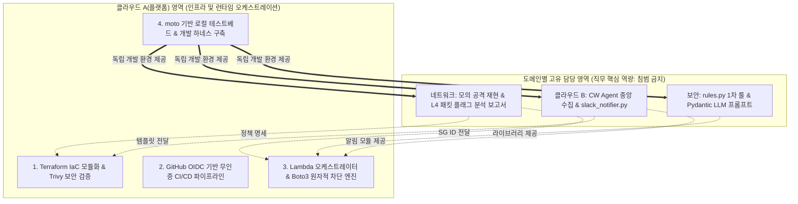

# CloudShield: 팀 프로젝트 메모리 스냅샷 (Project Context & Decisions)

> **최종 갱신일**: 2026-09-04  
> **용도**: 프로젝트 영구 지속성 메모리. 아키텍처 결정 사항(ADR), R&R 경계선, 기술 제약조건 및 개발 가이드라인을 추적함.

---

## 1. 프로젝트 배경 및 기본 정보

* **프로젝트명**: CloudShield (클라우드 하이브리드 위협 탐지·자동 대응 및 SecOps 파이프라인)
* **교육과정**: SKT ALEPH 보안 자동화 교육과정 (AI·자동화, 네트워크·ZT, 접근통제, 이상탐지, SOAR)
* **목표 일정**: 총 30일 (조기 개인 시간 20일 + 공식 강의 프로젝트 10일)
* **프로젝트 형태**: '단일 소프트웨어/웹 프로그램'이 아닌 **'침해 공격 $\rightarrow$ 실시간 탐지 $\rightarrow$ 복합 차단/격리 $\rightarrow$ 상황 전파' 10초 관통 데모 파이프라인**
  * *결정 사유*: 팀원 목표 직무가 클라우드/네트워크/보안 엔지니어이므로 웹/UI 코딩 매몰을 방지하고 실제 인프라 트래픽 제어 역량을 증빙함.

---

## 2. 팀 구성 및 R&R 경계선 (Non-infringement Principle)

플랫폼 엔지니어링을 주도하되, **각 직무 담당자의 고유 포트폴리오 핵심 지분을 상호 침범하지 않는다.**

### [직무별 단독 포트폴리오 자산]
1. **네트워크 담당**:
   * Hydra/Nmap 기반 공격 시뮬레이션 환경 및 스크립트 작성.
   * `tcpdump` 패킷 캡처 및 Wireshark L4 TCP 플래그/핸드셰이크 분석 보고서.
   * VPC Flow Logs CloudWatch Insights 쿼리 설계.
   * 침해 인스턴스 격리 Security Group(인/아웃바운드) 규칙 명세.
2. **클라우드 B 담당**:
   * 타깃 인스턴스(Ubuntu/Nginx) 환경 구축.
   * `amazon-cloudwatch-agent.json` 설정 및 OS/Web 로그 중앙 인제스트 파이프라인.
   * CloudWatch Logs 구독 필터(Subscription Filter) 패턴 정의.
   * Slack Incoming Webhook + Block Kit 카드 전송 모듈(`slack_notifier.py`).
3. **보안 담당**:
   * 정규표현식 기반 1차 시그니처 룰 엔진(`rules.py`).
   * MITRE ATT&CK TTP(T1110 등) 1:1 매핑 테이블 정의.
   * Pydantic 기반 정형 침해사고 스키마 설계.
   * LLM 프롬프트 Few-shot 엔지니어링 및 오탐/정탐 검증 테스트.
4. **클라우드 A 담당 (테크 리드 & 플랫폼 엔지니어)**:
   * 팀원 모듈이 단 한 줄 수정 없이 플러그인처럼 결합되는 **Lambda 오케스트레이터**.
   * Boto3 기반 다중 계층(L4 SG 격리 + L7 WAF IPSet + Identity IAM 세션 취소) 원자적 차단 엔진(`remediation.py`).
   * 전체 AWS 인프라 Terraform IaC 모듈화.
   * GitHub Actions OIDC 무인증 배포 CI/CD 파이프라인.
   * `moto` 기반 로컬 가상 AWS 테스트베드 및 개발 하네스 구축.

---

## 3. 핵심 아키텍처 결정 사항 (ADR Index)

> 상세 결정 배경, 대안 비교 및 트레이드오프는 [`docs/adr/`](adr/) 디렉토리의 개별 문서를 참조합니다 (Single Source of Truth).

| 번호 | 문서명 | 상태 | 결정 일자 | 핵심 요약 |
| :---: | :--- | :---: | :---: | :--- |
| **0001** | [`ADR-0001: 단일 AWS 계정 내 VPC 격리 채택`](adr/0001-single-aws-account-vpc-isolation.md) | Accepted | 2026-09-03 | 멀티 계정 권한 병목을 배제하고 단일 계정 내 Public/Private Subnet 및 Bastion 구조로 단순화 |
| **0002** | [`ADR-0002: 다중 계층 원자적 차단 엔진 아키텍처`](adr/0002-multi-layer-atomic-remediation.md) | Accepted | 2026-09-04 | L4(Quarantine SG), L7(WAF IPSet /32), Identity(IAM Session 무효화) 원자적 복합 대응 체계 |
| **0003** | [`ADR-0003: Lambda 동시성 통제로 비용 폭증 방지`](adr/0003-lambda-concurrency-limit-for-cost-control.md) | Accepted | 2026-09-04 | 무차별 공격 인입 시 LLM API 과금 폭증을 차단하기 위해 Lambda Reserved Concurrency를 5~10으로 제한 |
| **0004** | [`ADR-0004: 선(先) 하네스 배포, 후(後) 노션 연동`](adr/0004-harness-first-notion-deferred.md) | Accepted | 2026-09-05 | 외부 툴 연동 병목을 차단하기 위해 Contract/Mock 테스트베드를 선배포하고 노션은 단방향 비동기 연동 |
| **0005** | [`ADR-0005: Ruleset 단일화 및 1:1 상호 리뷰 거버넌스`](adr/0005-repository-ruleset-unification-and-peer-review-governance.md) | Accepted | 2026-09-09 | Classic 보호 규칙 충돌을 제거하고 Ruleset 단일화 및 1:1 상호 짝꿍 리뷰 체계 확립 |
| **0006** | [`ADR-0006: 에이전트 하네스 이원화 및 감사 투명성 설계`](adr/0006-agent-harness-dual-guard-architecture.md) | Accepted | 2026-09-09 | PR 메타데이터/테스트 경로 하드 가드 강제 및 솔직한 우회 증적(Audit Trail) 보존을 위한 이원화 설계 |
| **0007** | [`ADR-0007: 룰 엔진 무상태성 보장 및 상태 관리 경계 분리`](adr/0007-stateless-rule-engine-and-state-boundary.md) | Accepted | 2026-09-09 | 룰 엔진은 순수 함수로 유지하고, CW 배치 분할 세션 상태 유지는 오케스트레이터(클라우드 A) 책임으로 분리 |
| **0008** | [`ADR-0008: AI 에이전트 PR 스태킹 방지 WIP 가드 및 In-PR 커밋 거버넌스`](adr/0008-wip-limit-and-anti-pr-stacking.md) | Accepted | 2026-09-09 | 미머지 브랜치 위 후속 작업 누적(Stacking)을 스크립트 레벨에서 하드 차단하고 동일 PR 내 수정 커밋 강제 |

---

## 4. 직무 간 인터페이스 계약 (Data Contracts)

* **규격 1 (네트워크 $\rightarrow$ 타깃 서버)**:
  * 리눅스 표준 Syslog: `<월> <일> <시:분:초> <호스트> sshd[<PID>]: Failed password for <계정> from <IP> port <포트> ssh2`
* **규격 2 (타깃 서버 $\rightarrow$ Lambda)**:
  * CloudWatch Logs Subscription Filter 페이로드 (Base64 인코딩 및 Gzip 압축된 JSON).
* **규격 3 (보안 엔진 $\rightarrow$ 클라우드 A & B)**:
  * Pydantic V2 기반 `IncidentReport` (IPv4 정규식 및 EC2 Instance ID 유효성 검사기 내장).

---

## 5. 실행 로드맵 및 현재 구축 진행 상태

* **완료 내역 (하네스 및 거버넌스 파이프라인 완성)**:
  * **Day 1 기반 완성**: 레거시(SentinelHub) 완전 제거, Pydantic V2 기반 `src/contracts/` 2종 확정, `tests/mock_data/` 3종 생성, 계약 불변성(Drift Guard) 테스트 통과.
  * **에이전트 거버넌스 체계**: `.agent-role` 로컬 역할 잠금, `CLAUDE.md`, `.cursorrules`, `AGENTS.md` 개정 (경계선 소유권 매트릭스, 4대 직무별 산출물 특화 표준 명시).
  * **GitHub 배관 및 원격 가드**:
    * CI 파이프라인 (`.github/workflows/ci.yml`): `setup-uv` 캐시 적용 10초 컷.
    * PR 제목 린터 (`.github/workflows/pr_title_lint.yml`): Conventional Commit + 직무 스코프 강제.
    * 자동 라벨러 (`.github/workflows/labeler.yml`): 경로 기반 `role:*`, `area:*`, `type:*` 자동 부착.
    * 노션 동기화 배관 (`.github/workflows/notion_sync.yml`): PR 상태 단방향 동기화.
    * 브랜치 보호 및 머지 정책: Squash Merge 단독 활성화, 머지 후 브랜치 자동 삭제.
  * **문서 아카이브 체계**:
    * `docs/roles/{network,cloud-b,security,cloud-a}/`: 직무별 완결 산출물 자유 마크다운 저장소.
    * `docs/shared/{meetings,ideas}/`: 회의록 및 아이디어 공유 디렉토리 분리 신설.

* **차기 착수 단계 (Day 2 플랫폼 엔지니어링)**:
  1. `pyproject.toml`에 `boto3`, `moto[ec2,wafv2,iam]` 의존성 추가.
  2. `tests/conftest.py`에 Moto 가상 AWS 리소스(Quarantine SG, WAFv2 IPSet, IAM Role) 픽스처 구축.
  3. `src/remediation/remediation.py` 다중 계층(L4 SG 격리 / L7 WAF IPSet / IAM 세션 무효화) 원자적 복합 차단 엔진 구현.
  4. `tests/test_remediation.py` 가상 런타임 관통 검증.

