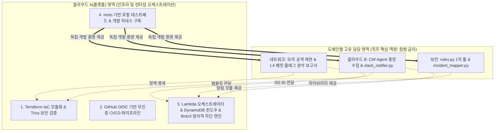

# CloudShield: 팀 프로젝트 메모리 스냅샷 (Project Context & Decisions)

> **최종 갱신일**: 2026-09-22  
> **용도**: 프로젝트 영구 지속성 메모리. 아키텍처 결정 사항(ADR), R&R 경계선, 기술 제약조건 및 개발 가이드라인을 추적함.

---

## 1. 프로젝트 배경 및 기본 정보

* **프로젝트명**: CloudShield (클라우드 하이브리드 위협 탐지·자동 대응 및 SecOps 파이프라인)
* **교육과정**: SKT ALEPH 보안 자동화 교육과정 (AI·자동화, 네트워크·ZT, 접근통제, 이상탐지, SOAR)
* **목표 일정**: 총 30일 (조기 개인 시간 20일 + 공식 강의 프로젝트 10일)
* **프로젝트 형태**: '단일 소프트웨어/웹 프로그램'이 아닌 **'침해 공격 $\rightarrow$ 실시간 탐지 $\rightarrow$ 복합 차단/격리 $\rightarrow$ 상황 전파' 10초 관통 데모 파이프라인**
  * *결정 사유*: 팀원 목표 직무가 클라우드/네트워크/보안 엔지니어이므로 웹/UI 코딩 매몰을 방지하고 실제 인프라 트래픽 제어 역량을 증빙함.

---

## 2. 팀 구성 및 R&R 경계선 (Non-infringement Principle)

플랫폼 엔지니어링을 주도하되, **각 직무 담당자의 고유 포트폴리오 핵심 지분을 상호 침범하지 않는다.**

### [직무별 단독 포트폴리오 자산]
1. **네트워크 담당**:
   * Hydra/Nmap 기반 공격 시뮬레이션 환경 및 스크립트 작성.
   * `tcpdump` 패킷 캡처 및 Wireshark L4 TCP 플래그/핸드셰이크 분석 보고서.
   * VPC Flow Logs CloudWatch Insights 쿼리 설계.
   * 침해 인스턴스 격리 Security Group(인/아웃바운드) 규칙 명세.
2. **클라우드 B 담당**:
   * 타깃 인스턴스(Ubuntu/Nginx) 환경 구축.
   * `amazon-cloudwatch-agent.json` 설정 및 OS/Web 로그 중앙 인제스트 파이프라인.
   * CloudWatch Logs 구독 필터(Subscription Filter) 패턴 정의.
   * Slack Incoming Webhook + Block Kit 카드 전송 모듈(`slack_notifier.py`).
3. **보안 담당**:
   * 정규표현식 기반 1차 시그니처 룰 엔진(`rules.py`).
   * MITRE ATT&CK TTP(T1110.001, T1110.003 등) 1:1 매핑 테이블 정의.
   * 결정론적 IncidentReport 매퍼(`incident_mapper.py`).
   * 오탐/정탐 검증 및 ReDoS 방어 단위 테스트.
4. **클라우드 A 담당 (테크 리드 & 플랫폼 엔지니어)**:
   * 팀원 모듈이 단 한 줄 수정 없이 결합되는 **Lambda 오케스트레이터**(`orchestrator.py`).
   * CloudWatch Logs 분할 배치 누락 방지를 위한 **DynamoDB 5분 슬라이딩 윈도우 원자적 카운터**(`auth_window.py`).
   * Boto3 기반 다중 계층(L4 SG 격리 + L7 WAF IPSet) 원자적 차단 엔진(`remediation.py`).
   * 전체 AWS 인프라 Terraform IaC 모듈화.
   * GitHub Actions OIDC 무인증 배포 CI/CD 및 R&R 하드가드 구축.
   * `moto` 기반 로컬 가상 AWS 테스트베드 및 개발 하네스 구축.

---

## 3. 핵심 아키텍처 결정 사항 (ADR Index)

> 상세 결정 배경, 대안 비교 및 트레이드오프는 [`docs/adr/`](adr/) 디렉토리의 개별 문서를 참조합니다 (Single Source of Truth).

| 번호 | 문서명 | 상태 | 결정 일자 | 핵심 요약 |
| :---: | :--- | :---: | :---: | :--- |
| **0001** | [`ADR-0001: 단일 AWS 계정 내 VPC 격리 채택`](adr/0001-single-aws-account-vpc-isolation.md) | Accepted | 2026-09-03 | 멀티 계정 권한 병목을 배제하고 단일 계정 내 Public/Private Subnet 및 Bastion 구조로 단순화 |
| **0002** | [`ADR-0002: 다중 계층 원자적 차단 엔진 아키텍처`](adr/0002-multi-layer-atomic-remediation.md) | Accepted | 2026-09-04 | L4(Quarantine SG), L7(WAF IPSet /32), Identity(IAM Session 무효화) 원자적 복합 대응 체계 |
| **0003** | [`ADR-0003: Lambda 동시성 통제로 비용 폭증 방지`](adr/0003-lambda-concurrency-limit-for-cost-control.md) | Accepted | 2026-09-04 | 무차별 공격 인입 시 LLM API 과금 폭증을 차단하기 위해 Lambda Reserved Concurrency를 5~10으로 제한 |
| **0004** | [`ADR-0004: 선(先) 하네스 배포, 후(後) 노션 연동`](adr/0004-harness-first-notion-deferred.md) | Accepted | 2026-09-05 | 외부 툴 연동 병목을 차단하기 위해 Contract/Mock 테스트베드를 선배포하고 노션은 단방향 비동기 연동 |
| **0005** | [`ADR-0005: Ruleset 단일화 및 1:1 상호 리뷰 거버넌스`](adr/0005-repository-ruleset-unification-and-peer-review-governance.md) | Accepted | 2026-09-09 | Classic 보호 규칙 충돌을 제거하고 Ruleset 단일화 및 1:1 상호 짝꿍 리뷰 체계 확립 |
| **0006** | [`ADR-0006: 에이전트 하네스 이원화 및 감사 투명성 설계`](adr/0006-agent-harness-dual-guard-architecture.md) | Accepted | 2026-09-09 | PR 메타데이터/테스트 경로 하드 가드 강제 및 솔직한 우회 증적(Audit Trail) 보존을 위한 이원화 설계 |
| **0007** | [`ADR-0007: 룰 엔진 무상태성 보장 및 상태 관리 경계 분리`](adr/0007-stateless-rule-engine-and-state-boundary.md) | Accepted | 2026-09-09 | 룰 엔진은 순수 함수로 유지하고, CW 배치 분할 세션 상태 유지는 오케스트레이터(클라우드 A) 책임으로 분리 |
| **0008** | [`ADR-0008: 결정론적 R&R 스코프 가드 및 단일 런타임 통일`](adr/0008-deterministic-rnr-scope-guard-and-single-runtime.md) | Accepted | 2026-09-17 | Node.js/Python 런타임 파편화를 단일 Python으로 통일하고 PR #45 R&R 침범 방지 물리적 하드가드 구축 |

---

## 4. 직무 간 인터페이스 계약 (Data Contracts)

* **규격 1 (네트워크 $\rightarrow$ 타깃 서버)**:
  * 리눅스 표준 Syslog: `<월> <일> <시:분:초> <호스트> sshd[<PID>]: Failed password for <계정> from <IP> port <포트> ssh2`
* **규격 2 (타깃 서버 $\rightarrow$ Lambda)**:
  * CloudWatch Logs Subscription Filter 페이로드 (Base64 인코딩 및 Gzip 압축된 JSON).
* **규격 3 (보안 엔진 $\rightarrow$ 클라우드 A & B)**:
  * Pydantic V2 기반 `IncidentReport` (IPv4 정규식 및 EC2 Instance ID 유효성 검사기 내장).

---

## 5. 실행 로드맵 및 현재 구축 진행 상태

* **완료 내역 (하네스, 거버넌스 및 코어 도메인 로직 완성)**:
  * **Day 1 기반 완성**: 레거시(SentinelHub) 제거, Pydantic V2 기반 `src/contracts/` 2종 확정, `tests/mock_data/` 표준 데이터셋 생성, 계약 불변성(Drift Guard) 테스트 통과.
  * **에이전트 거버넌스 및 R&R 하드가드**:
    * `.agent-role` 역할 잠금, `verify_rnr_scope.py` 물리적 스코프 하드가드 구축 (PR #45 사후 분석 및 ADR-0008 반영).
    * Python 단일 런타임(`uv run python`) 통일.
  * **Day 2 코어 플랫폼 및 도메인 로직 완결**:
    * Boto3 L4 EC2 Quarantine SG 격리 및 L7 WAF IPSet /32 원자적 차단 엔진 (`remediation.py`).
    * CloudWatch Logs 분할 배치 누락 방지용 DynamoDB 5분 윈도우 원자적 카운터 (`auth_window.py`).
    * 1차 시그니처 룰(`rules.py`) 및 결정론적 IncidentReport 매퍼(`incident_mapper.py`).
    * CloudWatch Logs 구독 필터 명세 및 Slack Block Kit 전파 모듈 (`cw_processor.py`, `slack_notifier.py`).
    * **2026-09-16 긴급 회의 의결 사항 반영**: 10초 관통 SLA를 위해 실시간 차단 경로에서 외부 LLM API를 배제하고 결정론적 매퍼로 완결하며, LLM은 사후 비동기(Out-of-band)로 이원화.

* **차기 착수 단계 (Day 3 관통 시나리오 통합 및 인프라 실증)**:
  1. `threat_orchestrator_handler`에 클라우드 B `slack_notifier` 연동 및 보안 `incident_mapper` 인터페이스 결합.
  2. 로컬 목 데이터 기반 10초 관통 E2E 시나리오 통합 테스트 작성 (`tests/integration/test_pipeline_scenario.py`).
  3. Docker Hydra SSH 공격 랩 실측 완료 (PR #68).
  4. Terraform IaC 모듈 작성 및 AWS 환경 관통 실증.

