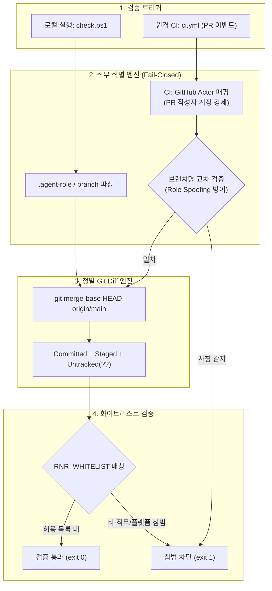

# [Post-Mortem & Architecture] R&R 경계선 침범 사고 분석 및 결정론적 하드가드·단일 런타임 구축 보고서

- **작성자**: 클라우드 A (테크 리드 / 플랫폼 엔지니어 @mmmphyun)
- **일자**: 2026-09-17
- **대상**: 플랫폼 거버넌스, CI/CD 보안 파이프라인, 로컬 하네스 툴체인
- **관련 커밋/PR**: PR #45 (사고 발생), PR #63 (해결 및 복원)

---

## 1. 사고 개요 및 사후 분석 (Incident Post-Mortem: PR #45)

### 1.1 사고 발생 경위
PR #45에서 클라우드 B 담당자가 CloudWatch Unified Agent 로그 수집 경로를 정의하는 과정에서, 플랫폼 전담 영역인 `scripts/` 및 `tests/unit/test_scripts.py`를 임의로 추가·수정한 커밋이 main 브랜치에 그대로 머지되는 사고가 발생함.

### 1.2 근본 원인 분석 (5-Whys)
1. **Why 1**: 클라우드 B 담당자가 왜 플랫폼 영역인 `scripts/`를 수정했는가?
   $\rightarrow$ 로컬에 Node.js가 없어 표준 스크립트(`get_my_tasks.js`)를 실행하지 못하자, Python으로 중복 구현(`get_my_tasks.py`)하여 커밋함.
2. **Why 2**: 왜 파이썬 프로젝트에서 보조 도구가 Node.js로 작성되어 있었는가?
   $\rightarrow$ 초기 하네스 구축 시 GitHub Actions 러너(`actions/github-script@v7`) 환경에 맞춰 로컬 도구까지 JavaScript로 작성하는 런타임 파편화 안티패턴이 존재했음.
3. **Why 3**: 왜 GitHub CODEOWNERS가 지정한 코드오너(@mmmphyun)의 승인 없이 머지되었는가?
   $\rightarrow$ 테크 리드의 리뷰 병목을 방지하기 위해 구축된 `auto_assign_reviewer.yml`이 짝꿍(네트워크) 외 모든 리뷰어를 GitHub API로 강제 삭제(Prune)했기 때문.
4. **Why 4**: 왜 CI 및 로컬 `check.ps1` 검증에서 침범이 걸러지지 않았는가?
   $\rightarrow$ 작성자 직무와 변경 파일의 도메인 매핑을 검증하는 물리적 하드가드(Scope Guard)가 전무했음.
5. **Why 5 (Root Cause)**:
   $\rightarrow$ **"규칙(AGENTS.md)을 정해두면 에이전트와 팀원이 지킬 것이다"라는 소프트 가드에 의존하고, 런타임 통일과 결정론적 하드가드를 구현하지 않은 설계 결함**.

---

## 2. 해결 아키텍처 및 엔지니어링 설계

### 2.1 결정론적 R&R 스코프 검증 엔진 (`scripts/verify_rnr_scope.py`)
- **CI GitHub Actor 강제**: CI에서는 브랜치명이 아닌 PR 생성자 GitHub 계정(`github.event.pull_request.user.login`)을 기반으로 직무를 판별함:
  - `mmmphyun` $\rightarrow$ `cloud-a` (플랫폼 전담 - 전 영역 허용)
  - `wkdtlgns99-cell` $\rightarrow$ `cloud-b`
  - `gkacksdnjs22-stack` $\rightarrow$ `security`
  - `RockCandy444` $\rightarrow$ `network`
- **역할 사칭(Role Spoofing) 원천 차단**: 타 직무 담당자가 `feat/cloud-a-...` 등으로 브랜치를 파서 권한 상승을 시도할 경우 계정과 브랜치명 불일치로 즉시 `exit 1` 차단.
- **Fail-Closed 정책**: 계정 또는 직무 미인식 시 무조건 에러 종료.
- **Git Diff 정밀 분기점 계산**: `git merge-base HEAD origin/main`을 사용하여 로컬 stale ref로 인한 타인 커밋 오탐을 차단하고, Staged 및 미추적(`??`) 신규 파일까지 전수 검사.

### 2.2 로컬 도구 체계의 Python 3.12 제로 디펜던시 단일화
- `scripts/*.js` 및 `tests/unit/*.js` 파일 4종을 전면 삭제.
- 파이썬 표준 라이브러리(`urllib.request`, `json`, `subprocess`, `pathlib`)만 사용하여 외부 의존성(0 dependencies) 없는 `get_my_tasks.py` 및 `list_team_members.py` 구축.
- 팀원 온보딩 사전 준비물을 `uv`와 `gh` 2개로 축소하여 Node.js 설치 요구사항 100% 제거.

---

## 3. 결함 주입 실측 데이터 (Fail Injection Testing)

| 시나리오 | 테스트 조건 | 기대 결과 | 실측 결과 |
| :--- | :--- | :--- | :---: |
| **타 직무 침범** | `PR_AUTHOR=wkdtlgns99-cell` (cloud-b)가 `scripts/` 수정 | `exit 1` 위반 파일 목록 출력 | **PASS (`exit 1`)** |
| **역할 사칭 (Spoofing)** | `PR_AUTHOR=wkdtlgns99-cell`이 `feat/cloud-a-hack` 브랜치 분기 | `exit 1` 사칭 감지 에러 출력 | **PASS (`exit 1`)** |
| **미등록 계정 (Fail-Closed)** | `PR_AUTHOR=unknown-hacker`로 CI 진입 | `exit 1` 미등록 계정 차단 | **PASS (`exit 1`)** |
| **정상 변경 통과** | `PR_AUTHOR=wkdtlgns99-cell`이 `nginx.conf`, `collector` 수정 | `exit 0` 정상 통과 | **PASS (`exit 0`)** |
| **전체 회귀 검증** | `powershell .\scripts\check.ps1` 전체 실행 | 린트, 포맷, 217개 테스트 100% 성공 | **PASS (217 passed)** |

---

## 4. DevSecOps 핵심 시사점 (Key Takeaways)

1. **소프트 가드의 무력함과 하드가드의 필연성**: 협업 헌법이나 에이전트 프롬프트 같은 자연어 지침은 인간과 LLM의 망각/착오에 의해 반드시 뚫림. 보안 경계선은 코드와 CI 파이프라인의 물리적 하드가드로만 보장됨.
2. **도구 체계의 일관성(Runtime Homogeneity)**: 프로젝트의 주 언어(Python)와 로컬 툴체인의 언어(Node.js)가 불일치하면 개발 환경 마찰로 인해 비표준 우회 코드가 유입됨. 제로 디펜던시 파이썬 도구화로 환경 오염을 차단함.
3. **리뷰어 병목과 보안의 분리**: 테크 리드가 모든 PR을 결재하지 않아도(1:1 짝꿍 리뷰 유지), CI 스코프 검증기가 기계적으로 R&R을 강제함으로써 개발 속도와 거버넌스를 동시에 확보함.
