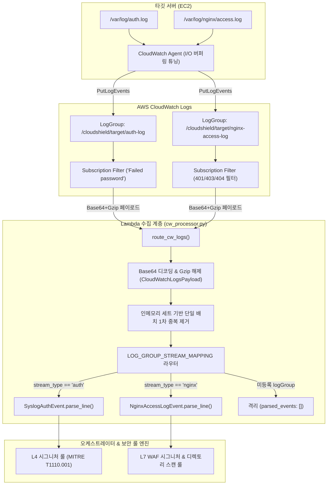

# CloudShield 기술 문서: CloudWatch 다중 스트림 라우터 및 Nginx 페이로드 디코더

- **문서 번호**: CS-DOC-CLOUDB-20260929-02
- **작성 일자**: 2026-09-29
- **작성자**: 클라우드 B 담당 (wkdtlgns99-cell)
- **관련 PR**: #94 (클라우드 A Nginx 계약 모델 연계), #95
- **관련 파일**: `src/collector/cw_processor.py`, `src/collector/__init__.py`, `tests/unit/test_collector.py`

---

## 1. 배경 및 아키텍처 목표

CloudShield는 단일 10초 관통 위협 탐지 및 다중 계층 자동 대응 파이프라인을 구축하고 있습니다.
시나리오 1(L4 SSH 무차별 대입)에 이어 시나리오 2(Web Directory Scan & Password Spraying)가 확장됨에 따라,
타깃 EC2에서 수집되는 원본 로그 스트림이 2개 계층으로 다변화되었습니다:

1. **L4 SSH 인증 로그**: `/cloudshield/target/auth-log` (배포 표준 설정 경로 / 호환 경로: `/aws/ec2/target-server/auth`)
2. **L7 Nginx 접근 로그**: `/cloudshield/target/nginx-access-log` (배포 표준 설정 경로 / 호환 경로: `/aws/ec2/target-server/nginx/access`)

단일 Lambda 위협 오케스트레이터가 두 로그 그룹의 Subscription Filter 이벤트를 수신할 때,
인입된 페이로드의 출처를 정확히 식별하여 해당 도메인에 특화된 불변 데이터 계약 모델
(`SyslogAuthEvent` vs `NginxAccessLogEvent`)로 파싱한 후 다운스트림 시그니처 룰 엔진에 공급해야 합니다.

본 문서는 PR #94에서 확정된 `NginxAccessLogEvent` 계약 규격을 기반으로,
클라우드 B 수집 파이프라인에서 구현된 **Nginx 전용 페이로드 디코더(`decode_nginx_cw_logs`)**와
**다중 스트림 정형 라우터(`route_cw_logs`)**의 기술적 메커니즘을 정의합니다.

---

## 2. 전체 수집 및 라우팅 파이프라인



---

## 3. 핵심 모듈 및 함수 명세

### 3.1 Nginx 전용 페이로드 디코더 (`decode_nginx_cw_logs`)

- **시그니처**: `decode_nginx_cw_logs(payload: dict[str, Any]) -> list[NginxAccessLogEvent]`
- **동작 원리**:
  1. Lambda 이벤트 딕셔너리(`{"awslogs": {"data": "<base64_gzip>"}}`)의 구조 유효성을 검증(TypeError, KeyError, ValueError).
  2. `CloudWatchLogsPayload.from_awslogs_data()`를 통해 Gzip 압축 스트림을 해제하고 원시 문자열 메시지 목록을 복원.
  3. 복원된 각 문자열에 대해 PR #94의 불변 계약 메서드 `NginxAccessLogEvent.parse_line()`을 호출하여 Pydantic 모델 인스턴스로 변환.
  4. Nginx 규격과 일치하지 않는 노이즈 라인(빈 줄, Syslog 라인, 비정상 문자열)은 `None` 안전 반환 특성을 활용하여 자동 필터링.

### 3.2 다중 스트림 라우터 확장 (`route_cw_logs`)

- **시그니처**: `route_cw_logs(payload: dict[str, Any], seen_event_ids: set[str] | None = None) -> dict[str, Any]`
- **반환 딕셔너리 규격**:
  ```python
  {
      "stream_type": "auth" | "nginx" | "unknown",
      "log_group": str,
      "log_stream": str,
      "messages": list[str],
      "parsed_events": list[SyslogAuthEvent | NginxAccessLogEvent],
      "event_ids": list[str],
      "subscription_filters": list[str],
      "dropped_duplicates": int,
  }
  ```
- **하위 호환성 100% 보존**:
  기존의 `stream_type`, `log_group`, `messages`, `event_ids`, `dropped_duplicates` 필드를 그대로 유지하면서,
  새롭게 정형화된 모델 리스트인 `parsed_events` 필드를 추가하여 상위 오케스트레이터의 파싱 오버헤드를 완전 제거함.

### 3.3 로그 그룹 경로 매핑 매트릭스 (`LOG_GROUP_STREAM_MAPPING`)

배포 설정(`amazon-cloudwatch-agent.json`)의 표준 경로와 추가적인 인스턴스 직접 수집 호환 경로를 모두 안전하게 수용하도록 매핑을 정합화함:

| 로그 그룹 경로 | 판별 스트림 (`stream_type`) | 파싱 계약 모델 (`parsed_events`) | 비고 |
| :--- | :---: | :---: | :--- |
| `/cloudshield/target/auth-log` | `auth` | `SyslogAuthEvent` | **배포 표준 경로** (`amazon-cloudwatch-agent.json` 기준 SSH) |
| `/cloudshield/target/nginx-access-log` | `nginx` | `NginxAccessLogEvent` | **배포 표준 경로** (`amazon-cloudwatch-agent.json` 기준 Nginx) |
| `/aws/ec2/target-server/auth` | `auth` | `SyslogAuthEvent` | 호환/대체 경로 (타깃 인스턴스 직접 수집 호환용) |
| `/aws/ec2/target-server/nginx/access` | `nginx` | `NginxAccessLogEvent` | 호환/대체 경로 (타깃 인스턴스 직접 수집 호환용) |
| *기타 미등록 경로* | `unknown` | `[]` (빈 리스트) | 오탐 및 비정상 트래픽 격리 |

---

## 4. 수집 시간 예산(3초) 설계 및 단계별 지연 추정치 (실측 전 분석)

10초 관통 자동 대응 파이프라인에서 수집 계층(Log Collection)에 할당된 목표 시간 예산은 **3초 이내**입니다.
현재 수치는 배포 설정(`force_flush_interval: 2`) 및 알고리즘 복잡도에 기반한 **이론적 추정치(Estimates)**이며,
AWS 네트워크 전송 및 Lambda 트리거를 포함한 실제 E2E 수집 관통 지연은 향후 모의 공격 실측 계측으로 최종 검증합니다.

| 수집 단계 | 처리 내용 | 예상 소요 시간 (추정치) | 비고 및 설계 근거 |
| :--- | :--- | :---: | :--- |
| **타깃 EC2 $\rightarrow$ CloudWatch** | CloudWatch Agent 버퍼 플러시 | Agent 버퍼 설정 2초; 전체 구간 상한 미검증 | `amazon-cloudwatch-agent.json` 배포 설정(`force_flush_interval: 2`) 기준 |
| **CloudWatch $\rightarrow$ Lambda** | Subscription Filter 트리거 및 전달 | ~0.5초 ~ 1.0초 (추정) | AWS 백본 내부 비동기 푸시 및 네트워크 전달 (실측 전 추정치) |
| **Lambda 디코딩 & 라우팅** | Base64/Gzip 해제 + 계약 모델 파싱 | **< 0.005초 (5ms, 추정)** | 100건 배치 기준 선형 O(N) 단일 패스 처리 (실측 전 벤치마크 추정치) |
| **합계 (추정치)** | **수집 Critical Path 추정 합계** | **약 2.5초 ~ 3.0초 내외** | **수집 목표 예산 충족 여부 미검증; 파일 감지 및 재시도 지연 미포함** |

> [!NOTE]
> **실측 검증 계획**: `force_flush_interval: 2`는 Agent 메모리 버퍼 체류 상한 시간이며 전체 3초 예산 준수를 단독으로 담보하지 않습니다.
> 수집 파이프라인 배포 및 모의 공격 시뮬레이션 환경에서 로그 발생 시각(타임스탬프)과 Lambda 인입 시각 간의 E2E 지연을 정밀 계측하여 3초 SLA 수렴 여부를 최종 확정할 예정입니다.

---

## 5. 경계 조건 및 아키텍처 트레이드오프

1. **단일 배치 인메모리 중복 제거의 한계**:
   - `route_cw_logs`에 전달되는 `seen_event_ids` 세트는 단일 Lambda 실행 환경의 프로세스 메모리에 국한됩니다.
   - Lambda 타임아웃, 동시성 확장(Scale-out), 또는 Cold Start 시 새 컨테이너가 기동되면 이전 메모리가 초기화되어 동일 `event.id`가 재수신될 수 있습니다.
   - **아키텍처 결정**: 분산 환경에서의 엄격한 멱등성(Idempotency) 보장은 수집 계층의 범위를 넘어서는 영역이므로, 향후 클라우드 A의 DynamoDB 원자적 상태 테이블(`auth_window.py`) 연계를 통해 해결하도록 책임을 분리합니다.

2. **비정상 로그 격리 (Fail-Safe)**:
   - Nginx 로그 스트림 내에 크래시 덤프, 포맷 깨짐, 빈 줄 등 비정상 문자열이 인입되더라도 예외를 발생시켜 배치 전체를 중단시키지 않고, `parse_line()`의 `None` 반환을 통해 안전하게 무시 처리합니다.
