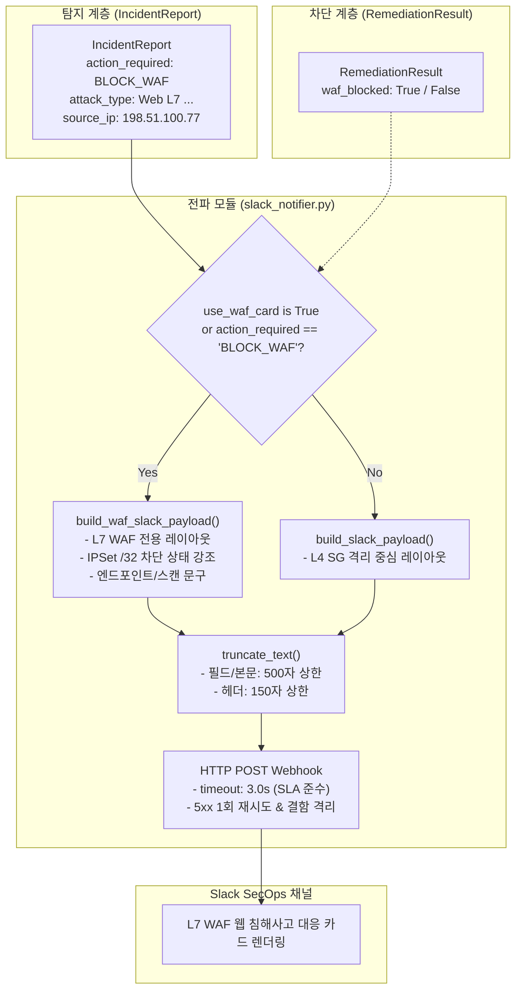

# CloudShield 기술 문서: L7 WAF 차단 전용 Slack Block Kit 알림 카드 템플릿

- **문서 번호**: CS-DOC-CLOUDB-20260930-01
- **작성 일자**: 2026-09-30
- **작성자**: 클라우드 B 담당 (`@wkdtlgns99-cell`)
- **연계 티켓**: [#105 L7 WAF 차단 전용 Slack Block Kit 알림 카드 템플릿 구현](https://github.com/mmmphyun/aleph-project/issues/105)
- **1차 리뷰어**: 네트워크 담당 (`@RockCandy444`)
- **관련 파일**: `src/reporter/slack_notifier.py`, `src/reporter/__init__.py`, `tests/unit/test_reporter.py`

---

## 1. 개요 및 설계 배경 (Why)

CloudShield의 핵심 프로젝트 정체성은 **단일 10초 관통 위협 탐지 및 다중 계층 자동 대응 파이프라인**입니다.
기존 시나리오 1(L4 SSH 무차별 대입 공격)에서는 인스턴스 보안 그룹(SG) 원자적 격리와 대상 시스템 계정(`target_accounts`)이 핵심 대응 축이었습니다.

반면, 시나리오 2(Web Directory Scan & Web Brute Force)는 다음과 같은 고유한 특성을 가집니다:
1. **L7 방어 계층 중심 대응**: 타깃 인스턴스 자체를 격리하면 웹 서비스 전체가 마비(가용성 침해)되므로, AWS WAFv2 WebACL 및 IPSet을 통해 공격자 IP(`/32`)만 정밀 차단해야 합니다.
2. **웹 엔드포인트 컨텍스트 특화**: 시스템 로그인 계정이 존재하지 않는 웹 스캐닝/디렉터리 탐색 특성상 계정 정보 대신 대상 엔드포인트 및 차단 IPSet 명칭(`CloudShield-Block-IPSet`)이 SecOps 관제 센터에 즉시 노출되어야 합니다.
3. **10초 관통 SLA 보장을 위한 결함 격리(Fault Isolation)**: 알림 전파 단계의 지연으로 파이프라인 전체 SLA(10초)가 훼손되지 않도록 최대 3.0초의 시간 예산(Time Budget) 내에서 전송을 완료하고 일시 오류를 안전하게 격리합니다.

본 문서는 이러한 요구사항을 반영하여 구현된 **L7 WAF 차단 전용 Slack Block Kit 알림 카드 템플릿(`build_waf_slack_payload`)** 및 자동 분기 파이프라인의 엔지니어링 명세를 정의합니다.

---

## 2. 전체 알림 전파 아키텍처 및 흐름도



---

## 3. L7 WAF Block Kit 페이로드 레이아웃 명세

### 3.1 4대 필수 식별자 및 최상위 메타데이터

프로젝트 헌법 제5.1조 제3항에 따라 Slack 알림 카드는 Block Kit 블록 배열뿐만 아니라 최상위 딕셔너리에 4대 필수 키를 반드시 포함합니다:

| 필드명 | 데이터 소스 | 설명 |
| :--- | :--- | :--- |
| `incident_id` | `report.incident_id` | 침해사고 고유 식별자 (예: `INC-20260904-003`) |
| `rule_name` | `report.attack_type` | 탐지된 공격 시그니처 룰 명 (예: `Web L7 Directory Scan`) |
| `source_ip` | `report.source_ip` | 차단된 공격자 IPv4 주소 (예: `198.51.100.77`) |
| `remediation_action` | `report.action_required` | 차단 지시 조치명 (`BLOCK_WAF`) |
| `is_waf_card` | `True` | WAF 전용 카드 여부 식별 불리언 플래그 |

### 3.2 Block Kit 블록 구조 및 WAF 특화 요소

```json
{
  "text": "[MEDIUM] CloudShield L7 WAF 차단 - INC-20260904-003: Web L7 Brute Force",
  "blocks": [
    {
      "type": "header",
      "text": {
        "type": "plain_text",
        "text": "🛡️ [CloudShield] L7 WAF 웹 침해사고 탐지 및 차단 알림",
        "emoji": true
      }
    },
    { "type": "divider" },
    {
      "type": "section",
      "text": {
        "type": "mrkdwn",
        "text": "*L7 웹 위협 요약:*\n출발지 IP 198.51.100.77로부터 웹 엔드포인트에 비정상적인 반복 인증 실패가 발생하여 WAF 차단을 요청합니다."
      }
    },
    {
      "type": "section",
      "fields": [
        { "type": "mrkdwn", "text": "*사건 ID (incident_id):*\n`INC-20260904-003`" },
        { "type": "mrkdwn", "text": "*공격 유형 (rule_name):*\nWeb L7 Brute Force" },
        { "type": "mrkdwn", "text": "*차단 IP (source_ip):*\n`198.51.100.77`" },
        { "type": "mrkdwn", "text": "*위험도 (risk_level):*\n*MEDIUM*" },
        { "type": "mrkdwn", "text": "*타깃 인스턴스:*\n`i-0123456789abcdef0`" },
        { "type": "mrkdwn", "text": "*대응 조치 (remediation_action):*\n*BLOCK_WAF*" }
      ]
    },
    {
      "type": "section",
      "text": {
        "type": "mrkdwn",
        "text": "*L7 WAF 방어 계층 집행 현황:*\n• 차단 계층: AWS WAFv2 WebACL & IPSet\n• 차단 대상: `198.51.100.77/32`\n• 상태: ✅ AWS WAFv2 IPSet `CloudShield-Block-IPSet` /32 등록 차단 집행 완료"
      }
    },
    {
      "type": "section",
      "text": {
        "type": "mrkdwn",
        "text": "*공격 대상 엔드포인트/계정:*\n지정 계정 없음 (웹 엔드포인트 URL/디렉토리 스캐닝)"
      }
    },
    {
      "type": "section",
      "text": {
        "type": "mrkdwn",
        "text": "*SecOps 웹 방어 권고 조치:*\n1. AWS WAF IPSet에 198.51.100.77/32 등록 및 인바운드 차단\n2. 웹 로그인 엔드포인트에 Rate Limiting 규칙 추가 적용"
      }
    },
    { "type": "divider" },
    {
      "type": "context",
      "elements": [
        {
          "type": "mrkdwn",
          "text": "MITRE ATT&CK: `T1110.001` | AWS WAFv2 L7 Defense Layer | CloudShield 10-Second Auto-Remediation"
        }
      ]
    }
  ]
}
```

### 3.3 차단 상태 3상(Tri-state) 매핑 규칙

`remediation_result` 수신 상태에 따라 다음 3가지 상태 문자열이 동적으로 렌더링됩니다:
1. **집행 완료 (`waf_blocked=True`)**: `✅ AWS WAFv2 IPSet `{ipset_name}` /32 등록 차단 집행 완료`
2. **집행 실패 (`waf_blocked=False`)**: `❌ AWS WAFv2 IPSet `{ipset_name}` 차단 실패 / 미완료`
3. **집행 대기/미수신 (`remediation_result is None`)**: `⏳ AWS WAFv2 IPSet `{ipset_name}` 차단 집행 진행 중 / 대기`

---

## 4. 엔지니어링 표준 및 제약조건 (Constraints & Standards)

1. **Slack Block Kit 글자 수 상한 및 `truncate_text`**:
   - Slack API 규격: 섹션 텍스트 블록 최대 3,000자, 필드 최대 2,000자.
   - 프로젝트 헌법 기준: 가독성 확보 및 오버헤드 방지를 위해 모든 텍스트 블록에 대해 **최대 500자(헤더 150자)** 안전 자르기(`truncate_text`) 강제.
2. **모듈 인터페이스 완결성 (`src/reporter/__init__.py`)**:
   - 외부(오케스트레이터 및 타 모듈)에서 직관적으로 import할 수 있도록 `__all__`에 `build_slack_payload`, `build_waf_slack_payload`, `send_slack_alert`, `truncate_text` 등 공용 API를 명시적으로 노출.
3. **10초 관통 SLA 타임아웃 및 결함 격리 (Fault Isolation)**:
   - 네트워크 타임아웃: 3.0초 (`timeout=3.0`).
   - Slack Webhook 5xx 또는 일시적 네트워크 단절 시 0.5초 대기 후 최대 1회 재시도.
   - 4xx 클라이언트 오류 발생 시 재시도 없이 즉시 종료(`return False`).
   - 예외 발생 시 상위 오케스트레이터로 전파하지 않고 에러 로깅 후 `False`를 안전 반환하여 핵심 차단 트랜잭션 보호.

---

## 5. 단위 테스트 및 검증 결과

`tests/unit/test_reporter.py` 내 총 34개 테스트 케이스 전수 통과:
- `test_reporter_package_exports`: `src/reporter` 패키지 수준 `__all__` export 무결성 검증.
- `test_build_waf_slack_payload_required_keys`: 4대 필수 키 및 WAF 레이아웃 무결성 검증.
- `test_build_waf_slack_payload_remediation_status`: 3상 차단 상태(성공/실패/대기) 및 커스텀 IPSet명 표시 검증.
- `test_build_waf_slack_payload_truncation`: 초과 길이 필드 500자 안전 자르기 검증.
- `test_build_waf_slack_payload_empty_accounts_and_recommendations`: 계정 및 권고 조치 누락 시 기본 대체 안내 문구 렌더링 검증.
- `test_send_slack_alert_auto_waf_payload`: `BLOCK_WAF` 조치 시 자동 WAF 전용 카드 분기 검증.
- `test_send_slack_alert_explicit_use_waf_card_override`: `use_waf_card` 명시 플래그 오버라이드 동작 검증.
