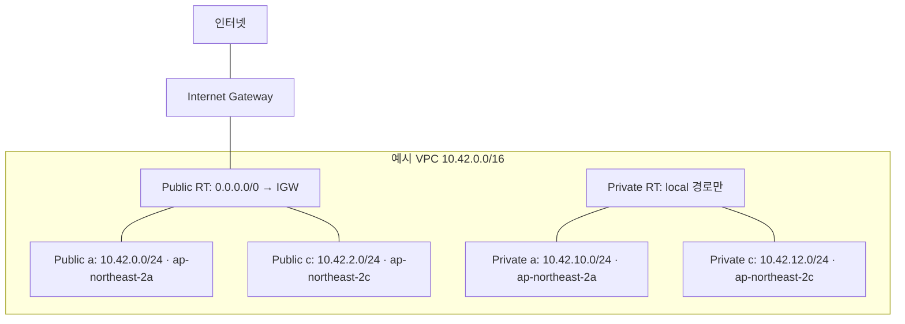

# VPC 및 격리 SG 모듈 설계·로컬 검증

- 기준일: 2026-10-08 KST
- Notion Task: https://notion.so/3ea04d37c22581e0981bc3d45a22927f
- GitHub Issue: https://github.com/mmmphyun/aleph-project/issues/153
- 최초 기준 main: `2684ee1` (PR #147 머지 포함)
- 재개 시 반영한 main: `ca8bd83` (클라우드 A 권한 핫픽스 PR #157 및 WAF PR #155 포함)
- 사용자 승인: 네트워크 역할에 이번 작업만 두 모듈 경로 추가 허용, RFC 후 “진행해”.
- 수정 범위: `infra/terraform/modules/vpc/**`, `infra/terraform/modules/quarantine_sg/**`,
  `docs/roles/network/**`, `tests/unit/test_network.py`만 사용한다.
- 모듈 구현과 로컬 검증은 실제 루트 결합·AWS 배포·SG 부착·복구·10초 E2E 성공과 별개다.

## 1. 티켓 및 기존 자산 확인

노션을 읽기 전용으로 조회했다. 본문은 VPC/Public·Private/IGW/Route Table 및 기본·격리
SG HCL 작성, CIDR/stateful 원리, 보안 리뷰어 `gkacksdnjs22-stack`을 요구한다.
배포와 실제 실측은 이 티켓 본문에 없으며 사용자도 이번 작업에서 제외했다.
네트워크 열린 PR 0건, 기존 티켓 Issue 없음 확인 후 Issue 153을 생성했다.

루트는 DynamoDB와 Lambda만 결합되어 있었고 VPC·SG 구현은 없었다.
루트의 Phase 2 주석은 `module.vpc.target_subnet_id`와
`module.vpc.target_security_group_id`를 가정하지만 이번 구현은 두 모듈을 분리하므로
아래 예시대로 클라우드 A가 결합해야 한다. 루트나 다른 모듈은 수정하지 않았다.

재사용한 근거:

- [PR #147 SG 실측 준비 보고서](2026-09-29-l7-attack-simulation-guide.md):
  SG 교체·기존 연결·ENI·복구 조건과 합성 증거의 한계를 계승한다.
- [WAF 패킷 실측 준비](waf-packet-measurement.md): 보호 경로·출발지·HTTP/패킷·복구 증거를 구분한다.
- `src/contracts/incident.py`, `events.py`, 탐지 매퍼, 대응 엔진과 관련 테스트를 읽기 전용 확인했다.
  계약 모델·탐지·오케스트레이션을 복제하지 않는다.
- [클라우드 A PR #149](https://github.com/mmmphyun/aleph-project/pull/149),
  검토한 head `f07b992ac0f02679dc99be4df6dd49ea38a1ad30`:
  Lambda IAM 잘못된 참조 수정, Windows/Linux provider lock, 로컬 사전 검증 보고서를 확인했다.
  최초 정찰 당시 별도 PR이었으며 재개 시 main에 머지된 변경을 그대로 반영했다.
  클라우드 A 파일을 직접 수정하지 않았다.
  문서 기준 도구는 Terraform 1.16.5 / Trivy 0.75.0, 검사는 `trivy config infra/terraform`이다.

## 2. VPC 토폴로지와 입력 방어

다음 CIDR과 AZ는 **제안/예시이며 실제 AWS 계정 조회 결과가 아니다**.



Public 구분은 IGW 라우팅으로 결정한다. 자동 공인 IP 할당은 두 계층 모두 끄며,
Public EC2의 인터넷 통신에는 클라우드 A/B가 공인 IP·서비스·SG·NACL 조건을 따로 확정해야 한다.
Private은 local 경로만 존재하고 IGW 기본 경로가 없다. NAT/Endpoint/VPN/Peering은 생성하지 않는다.
미사용 default SG도 빈 규칙으로 관리하므로 기본 SG라는 용어를 서비스용 `baseline` SG와 혼동하지 않는다.

| 자동 검증 | 방식 |
| --- | --- |
| IPv4 CIDR 문법·정규 네트워크 주소 | `cidrnetmask`, `cidrhost`, 접두 길이 /16~/28 검증 |
| VPC 밖 서브넷 | IPv4 시작·끝 주소 정수 비교를 VPC precondition에서 차단 |
| 중복·부분 겹침 | Public+Private 전체 범위 쌍 비교; 최대 200개로 비교량 제한 |
| AZ와 서브넷 불일치 | 이름 형식과 명시한 AZ 집합 소속 검증; 각 서브넷에 CIDR/AZ를 함께 지정 |
| 계층 누락 | Public/Private 각각 1개 이상, 합계 200개 이하 |
| 경로 혼입 | Private `route = []`, 명시적 계층별 association 및 mock 검증 |

수동 확인: 실제 계정의 AZ/리전 가용성, 다른 VPC·사내 네트워크와 CIDR 충돌, AWS 예약·금지
주소 범위, 리소스 quota, 서브넷 내 가용 주소 수, NACL/실제 대상 ENI/공인 IP 조건.
AZ 이름은 계정마다 물리 AZ 매핑이 다를 수 있다. 여러 리전의 AZ를 집합에 섞지 않는다.

## 3. 기본 및 격리 SG 정책

| SG / 방향 | 허용 규칙 | 설계 이유 |
| --- | --- | --- |
| baseline ingress | 승인 CIDR + TCP/UDP + 포트 범위만 입력; 기본값 없음 | 모의 공격·서비스 입력을 명시적으로 검토 |
| baseline egress | 승인 목적지 CIDR + TCP/UDP + 포트만 입력; 빈 map 가능 | 외부 개방을 암묵적으로 만들지 않음 |
| quarantine ingress | `[]` | 새 인바운드 연결 허용 규칙 없음 |
| quarantine egress | `[]` | AWS 생성 기본 allow-all egress가 잔존하지 않도록 관리 |
| VPC default SG | ingress/egress 모두 `[]` | 기본 SG를 잘못 부착했을 때 개방 방지 |

기존 SSH 실험은 TCP 22, 현재 `nginx.conf`는 HTTP 80을 사용한다. HTTPS 443 서비스,
실제 공격 출발지/관리 CIDR, DNS·CloudWatch·패키지 다운로드 목적지는 미확정이다.
HTTP/SSH도 모듈 기본 허용값으로 넣지 않는다. WAF 보호 대상의 SG 참조가 필요하면
클라우드 A/B와 별도 인터페이스를 설계한다. 현재 모듈은 IPv4 CIDR TCP/UDP만 지원한다.

SG는 stateful이므로 허용 연결의 응답 트래픽은 별도의 역방향 허용 규칙 없이 통과한다.
새 외부 연결을 위한 egress는 별도 정책이다. IPv6, ICMP, 전체 프로토콜은 지원하지 않는다.
`/0`, 비정규 CIDR, 잘못된 포트, 중복 규칙, 방향별 60개 초과를 거부한다.
여러 넓은 CIDR의 합집합으로 인터넷 전체를 허용하는지까지는 계산하지 않으므로 최소 범위 리뷰가 필요하다.

AWS provider 5.100.0은 SG 생성 시 AWS 기본 egress를 제거한다. 규칙 인자 생략은 기존
관리 규칙 제거와 같지 않으므로 빈 목록을 명시한다. 일반 권고는 독립 rule 리소스지만,
이번 모듈은 **SG별 전체 집합의 단일 소유권 및 빈 목록 전환**을 위해 inline 목록을 사용한다.
한 규칙에 CIDR 하나만 쓰며 동일 SG에 독립 rule 리소스를 혼용하지 않는다.
provider 동작과 mock 검증은 실제 AWS 적용 후 규칙 조회를 대신하지 않는다.

## 4. 입력·출력과 클라우드 A 결합 예시

입력 상세는 각 모듈 README와 `variables.tf`에 있다. 필수 입력은 VPC `topology`,
SG `vpc_id`와 `traffic`이며 태그는 루트 `Project/ManagedBy/Env`를 상속하고
기존 모듈 관례대로 `Environment` 및 `Name`을 추가한다.

| 출력 | 소비 목적 |
| --- | --- |
| VPC `vpc_id`, `vpc_cidr` | 두 SG 및 EC2의 같은 VPC 계약 |
| VPC `public_subnet_ids`, `private_subnet_ids` | 입력 이름별 서브넷 선택 |
| VPC `internet_gateway_id`, `route_table_ids`, `route_table_association_ids` | 라우팅 결합·조회 식별자 |
| SG `baseline_sg_id` | EC2 초기 서비스용 SG 후보 |
| SG `quarantine_sg_id`, `quarantine_sg_name` | 격리 엔진 대상 식별 및 이름 탐색 계약 |
| SG `quarantine_sg_arn` | 기존 Lambda 모듈 IAM 입력 `quarantine_sg_arn` |
| SG `vpc_id` | 결합 VPC 확인 |

아래는 **루트 소유자가 검토할 예시**다. 루트 파일을 수정한 것이 아니며,
문서용 `198.51.100.10/32`는 실제 공격자 주소가 아니다.

```hcl
module "vpc" {
  source      = "./modules/vpc"
  environment = var.environment
  topology = {
    vpc_cidr           = "10.42.0.0/16"
    availability_zones = ["ap-northeast-2a", "ap-northeast-2c"]
    public_subnets = {
      a = { cidr = "10.42.0.0/24", availability_zone = "ap-northeast-2a" }
      c = { cidr = "10.42.2.0/24", availability_zone = "ap-northeast-2c" }
    }
    private_subnets = {
      a = { cidr = "10.42.10.0/24", availability_zone = "ap-northeast-2a" }
      c = { cidr = "10.42.12.0/24", availability_zone = "ap-northeast-2c" }
    }
  }
}

module "quarantine_sg" {
  source      = "./modules/quarantine_sg"
  vpc_id      = module.vpc.vpc_id
  environment = var.environment
  traffic = {
    ingress = {
      ssh_test = {
        cidr = "198.51.100.10/32", protocol = "tcp"
        from_port = 22, to_port = 22, description = "Example approved SSH test source"
      }
      http_test = {
        cidr = "198.51.100.10/32", protocol = "tcp"
        from_port = 80, to_port = 80, description = "Example approved HTTP test source"
      }
    }
    egress = {} # 수집·업데이트 경로는 미설계 상태; 동작 가능하다는 의미가 아니다.
  }
}

# 기존 module.lambda 블록의 입력을 클라우드 A가 변경할 때:
# quarantine_sg_arn = module.quarantine_sg.quarantine_sg_arn
# 클라우드 B EC2 모듈과 인터페이스를 확정한 뒤 사용할 값:
# subnet_id          = module.vpc.public_subnet_ids["a"]
# security_group_ids = [module.quarantine_sg.baseline_sg_id]
```

대응 엔진은 EC2 `VpcId`를 읽고 기본 이름 `CloudShield-Quarantine-SG`를 해당 VPC에서
탐색한다. `IpPermissions`와 `IpPermissionsEgress`가 모두 빈 목록이어야 통과한다.
그 뒤 `modify_instance_attribute(InstanceId, Groups=[격리 SG])`로 기존 목록을 교체한다.
추가 부착이 아니다. ID를 직접 전달하는 경로는 VPC 일치의 별도 선행 검사가 없으므로
소비자가 EC2/SG VPC 일치를 보장해야 한다. 이번 모듈은 실제 EC2를 조회하거나 부착하지 않는다.
현재 Lambda IAM의 ARN 입력과 런타임의 SG ID/이름 입력을 혼동하지 않는다.

## 5. 배포·관리·복구·연결 추적 조건

- Private 외부 통신: local 경로만으로 CloudWatch/SSM/패키지 저장소에 접근할 수 있다고
  가정하지 않는다. NAT 또는 필요한 Endpoint·DNS·egress 설계는 클라우드 A/B 협업 범위다.
- VPC Flow Logs: 이번 기본 네트워크 모듈은 로그 저장소/수명/암호화/IAM을 임의 생성하지 않는다.
  Trivy `AWS-0178` MEDIUM이 남는다. 로그 목적지·권한·비용·보존 정책을 클라우드 A/B가
  확정해 연계하고 재검사해야 한다. 예외 주석이나 심각도 필터로 숨기지 않는다.
- 격리 SG의 egress가 비어 있으면 관리 SSH/SSM 유지도 보장되지 않는다. 외부 EC2 제어 API
  경로·권한·담당자와 ENI별 기존 SG 스냅샷, 동시 변경 대조 및 복구 증거가 필요하다.
- 기존 엔진은 원래 SG를 영속 보관하거나 자동 복구하지 않는다. 다중 ENI 지원·실제 관측 ENI는
  클라우드 A가 확인한다. 이름/VPC를 바꾸면 SG 재생성이 필요할 수 있고 부착 중 삭제는 실패할 수 있다.
- AWS connection tracking, 호스트 conntrack, TCP 소켓 상태는 별개다. tracked 연결은
  규칙 변경 후에도 유지될 수 있으며 untracked/자동 추적 조건과 실제 SG 교체 영향을 분리해 실측한다.
- SG는 Route 53 Resolver 같은 일부 트래픽을 필터링하지 못한다. 빈 SG는 모든 종류의
  트래픽·기존 연결 차단을 보장하지 않는다. FIN/RST 송신, 완전 격리, 10초 E2E를 주장하지 않는다.
- WAF는 연결된 HTTP 보호 경로에서 평가하며 SSH/TCP 세션 종료 수단이 아니다.

## 6. 로컬 검증 및 협업 조건

Windows / Python 3.12.14 / Terraform 1.16.5 / AWS provider 5.100.0 / Trivy 0.75.0.
도구는 공식 배포 SHA-256을 대조했고 공통 의존성·루트 lock은 변경하지 않았다.
처음 Terraform 1.9.8로 두 모듈 validate가 통과했으며, computed 출력의 plan 시점 mock
주입을 위해 클라우드 A와 같은 1.16.5로 테스트했다. 동봉한 테스트 실행은 1.16.5를 사용한다.

| 검사 | 결과 |
| --- | --- |
| 두 모듈 `init -backend=false -input=false` | 성공, AWS provider 5.100.0 설치; AWS 배포 검증 아님 |
| 두 모듈 `fmt -check -recursive`, `validate` | 각각 exit 0 / 0, Terraform 1.16.5 |
| VPC mock plan | 14 passed, 0 failed |
| SG mock plan | 17 passed, 0 failed |
| pytest Terraform 연계 | 2 passed, 408 deselected; 31개 mock 결과·실패/skip 0 확인 |
| 전체 Ruff lint / format | exit 0 / 0 |
| 최초 전체 pytest | exit 0, **882 passed, 2 warnings**, 132.74초 |
| 최초 원본 `powershell .\scripts\check.ps1` | exit 1, 당시 R&R 단계에서 `quarantine_sg` 허용 누락으로 중단 |
| Trivy 전체 심각도, `--exit-code 1` | VPC exit 1: MEDIUM AWS-0178 1건; SG exit 0; HIGH/CRITICAL 0건 |

최초 공통 검사기는 `vpc/**`만 허용했다. 클라우드 A PR #157이 검사기와 AGENTS.md 및
회귀 테스트를 수정한 뒤 main에 머지됐으며, 재개 시 해당 main을 기존 작업 브랜치에 반영했다.
이 작업에서 검사기나 역할 파일을 수정해 우회하지 않았다.

### 1차 재개 후 검증 결과 (보안 PR #159 반영 전)

| 검사 | 결과 |
| --- | --- |
| 원본 작업 트리의 `powershell .\scripts\check.ps1` | R&R 통과 후 기존 `.pytest_cache` 열거 권한 오류로 exit 1; 자료·ACL 보존 |
| SHA-256 동일 임시 체크아웃의 동일 명령 | **exit 0**, R&R·테스트 경로·Ruff lint·format·pytest 모두 통과 |
| 단일 게이트 내 실제 pytest | **883 passed, 2 skipped, 1 warning**, 130.72초 |
| 두 모듈 fmt / init / validate | 각 exit 0; `init -backend=false -input=false`, AWS provider 5.100.0 |
| 네트워크 Terraform mock | **VPC 14 / SG 17 passed**, 실패 0; pytest 연계 2건도 실행·통과 |
| Trivy 예시 입력 명시 재검사 | VPC exit 1: AWS-0178 MEDIUM 1건; SG exit 0; HIGH/CRITICAL 0건 |

임시 체크아웃은 `C:/Users/User/AppData/Local/Temp/cloudshield-network-pr154-resume`이며,
원본의 추적 파일 **199개 전체를 바이트 단위로 복사한 뒤 SHA-256 일치**를 확인했다.
원본 `check.ps1`과 검사 기준을 그대로 사용했고 `.agent-role`은 `network`로 설정했다.
검증용 module lock 2개도 동일성을 확인했으며 커밋에서 제외한다.
해시 manifest는 같은 임시 상위 경로의 `cloudshield-network-pr154-resume-sha256.json`,
실제 단일 게이트 로그는 `cloudshield-network-resume-check-identical.log`로 보존했다.
manifest SHA-256: `d18b78da1bbfe4c5632de861a062921d6b7ab75c188947da11a319f682f08474`.
실행한 `check.ps1` SHA-256: `8b89383ac3366d4c4c95842e9ef24e9438ccfc21ea7a6c6d1efd51acad8c88fa`.
결과 문서는 검증 완료 후 갱신했다. 런타임 코드·테스트·검사기는 검증 중 변경하지 않았다.

실행 환경: Windows, Python 3.12.14, pytest 8.4.2, Ruff 0.16.4, moto 5.2.3, boto3 1.43.88,
Terraform 1.16.5, AWS provider 5.100.0,
Trivy 0.75.0. 임시 환경 의존성은 저장소 lock을 그대로 사용한 `uv sync --all-extras`로 설치했다.
skip 2건은 main에 추가된 보안 담당 WAF Terraform 테스트이며, 해당 fixture가 요구하는
PATH상의 Terraform 및 WAF 모듈 `.terraform/providers`가 없어 명시적으로 skip됐다.
타 직무 검증 환경을 바꾸거나 WAF plan을 실행하지 않았다. 네트워크 테스트는 별도 명시한
Terraform 실행 파일과 임시 provider 디렉터리를 사용해 31개 mock plan을 전부 검증했다.
warning 1건은 기존 `test_network_socket_is_blocked_by_default`의 소켓 차단 확인이다.

### 보안 PR #159 반영 후 필수 모드 재검증

보안 PR #159가 머지된 main `98c2477`을 기존 작업 브랜치에 병합했다.
보안 담당 테스트·WAF 모듈·공통 검사기·CI를 직접 수정하지 않았다.
추가된 `CLOUDSHIELD_REQUIRE_WAF_TERRAFORM=1`은 WAF 검증 준비가 없을 때
skip 대신 실패시키는 모드다. Terraform을 PATH에 두고 임시 체크아웃의 WAF 모듈을
`init -backend=false -input=false -lockfile=readonly`로 준비해 두 검증을 실제 실행했다.
VPC·격리 SG도 backend 없는 init 후 fmt 및 validate를 재실행했다.

| 검사 | 결과 |
| --- | --- |
| 원본 `powershell .\scripts\check.ps1` | R&R 통과 후 기존 `.pytest_cache` 권한 오류로 exit 1; 자료·ACL 보존 |
| 동일 파일 임시 체크아웃의 동일 명령, WAF 필수 모드 | **exit 0**, R&R·경로·Ruff lint·format·pytest 통과 |
| 실제 pytest | **897 passed, 0 skipped, 1 warning**, 147.82초 |
| 기존 WAF Terraform 2건 | mock provider 테스트 및 합성 local state의 차단 주소 보존 검증 모두 실행·통과 |
| 네트워크 Terraform 연계 2건 | VPC 14 / SG 17 mock plan 실행·통과 |
| VPC·격리 SG·WAF fmt / validate | 각각 exit 0 / 0; AWS 배포 검증 아님 |

환경은 Windows / Python 3.12.14 / pytest 8.4.2 / Ruff 0.16.4 / Terraform 1.16.5 /
AWS provider 5.100.0이며 저장소 lock으로 `uv sync --all-extras --frozen`을 실행했다.
임시 경로는 `C:/Users/User/AppData/Local/Temp/cloudshield-network-pr154-security159`다.
검증 전 추적 파일 **199개 전체 SHA-256 일치**를 확인했고 결과 문서는 검사 후 갱신했다.
같은 상위 경로의 `cloudshield-network-pr154-security159-sha256.json` manifest SHA-256은
`360626af0e3ff74f2a3120fcde6868d8a5b97e9a574cfaf569676a30cd026079`다.
실행한 `check.ps1` SHA-256은 위 1차 재개 때와 동일하다.
전체 로그는 `cloudshield-network-security159-full-check.log`, 원본 실패 로그는
`cloudshield-network-security159-original-check.log`에 보존했다.
warning 1건은 기존 소켓 차단 확인이며 실패나 스킵이 아니다.

WAF 주소 보존 검증은 가짜 자격증명과 계정/자격증명/메타데이터 조회 생략 설정을 사용한다.
합성 local state에 대해 `plan -refresh=false`를 실행하고 결과 JSON을 검사한다.
이는 실제 AWS state나 계정에 대한 plan이 아니며 AWS 접속·배포·실측은 수행하지 않았다.
공유 `TF_DATA_DIR`은 설정하지 않고 네트워크 연계 테스트에만 모듈별 provider 경로를 전달했다.
CI의 Terraform 설치·init·필수 모드 설정은 여전히 클라우드 A 소유 협업 항목이다.
PR #159의 필수 모드 추가만으로 현재 CI의 선택적 skip이 제거되었다고 주장하지 않는다.

최초 검증에서 uv 샌드박스 캐시 권한 오류는 원본 자료·ACL을 변경하지 않고 정상 사용자
실행으로 처리했다. 원본 pytest 캐시 권한도 보존했다. 아래 임시 체크아웃은 재개 시 사용했다.
Terraform pytest는 모듈만 임시 폴더에 복사해 모든 복사 파일의 SHA-256 동일성을 assert한 뒤
mock 테스트하며 원본을 변형하지 않는다. SHA-256 검사 추가 후 해당 2개 테스트도 다시 통과했다.
전체 pytest의 경고는 기존 소켓 차단 확인 경고 1개와 원본 pytest 캐시 권한 경고 1개다.
Trivy는 미지정 변수 실행 및 별도 임시 `.tfvars`에 문서용 입력을 지정한 실행 모두 같은 결과였다.
예시 입력 지정 실행에는 변수 누락 경고가 없었다. 스캔 제외/ignore/심각도 제한은 사용하지 않았다.

pytest 연계 재현 환경(경로는 검증자가 지정):

```powershell
$env:CLOUDSHIELD_TERRAFORM = "<Terraform 1.16.5 실행 파일 절대 경로>"
$env:CLOUDSHIELD_TF_DATA_VPC = "<vpc init 때 사용한 TF_DATA_DIR>"
$env:CLOUDSHIELD_TF_DATA_QUARANTINE_SG = "<quarantine_sg init 때 사용한 TF_DATA_DIR>"
uv run python -m pytest tests/unit/test_network.py -k terraform_network -v
```

도구 경로 미설정 시 두 pytest 항목은 명시적으로 skip된다. 기존 CI에는 Terraform 설치
단계가 없으므로 로컬 Terraform 검증을 CI 성공으로 표현하지 않는다. 네트워크 mock run은
plan만 실행한다. WAF 재검증의 mock 및 합성 state plan과 실제 AWS plan을 구분하며,
실제 AWS `plan/apply/destroy/import` 및 AWS 리소스 조회는 수행하지 않았다.

모듈 구현과 필수 로컬 검증·CI 결과를 확인해 기존 PR에서 리뷰를 받는다.
Flow Logs의 저장소·권한·보존 정책은 클라우드 A/B 결합 협업 사항으로 남기며,
Trivy 전체 심각도 검사 결과를 통과로 바꾸어 기록하지 않는다.
루트 결합·배포·실측은 다른 작업의 범위다. 이번 요청에서 PR을 머지하지 않는다.

## 7. 자동화와 완료 구분

`notion_sync.yml`은 PR opened/reopened 때 카드 상태를 검토 중으로, merged 때 완료로
전이한다. 머지 시 PR 본문의 모든 `#숫자`를 찾아 열린 Issue를 종료하며 `Refs`도 예외가 아니다.
Draft 여부도 이 자동화의 상태 전이 조건에서 검사하지 않는다. 따라서 Draft 자체가 노션
전이를 차단한다고 주장하지 않는다. 에이전트는 노션 상태·속성을 직접 변경하지 않았다.
선행 PR #147의 머지는 AWS 실측 완료 증거가 아니며 그 보고서의 미실측 상태를 계승한다.
재개 시 읽기 전용 조회에서 Issue 153은 OPEN, 노션 카드는 검토 중이었다.
이 티켓은 모듈 작성 범위이며 루트 결합·AWS 배포·실측 성공으로 확장하지 않는다.
리뷰를 기다리고 이번 요청에서는 머지/완료 처리를 수행하지 않는다.

## 8. 공식 근거 (2026-10-08 확인)

- [AWS 서브넷 유형과 라우팅](https://docs.aws.amazon.com/vpc/latest/userguide/configure-subnets.html)
- [AWS SG 규칙과 기본 egress](https://docs.aws.amazon.com/vpc/latest/userguide/security-group-rules.html)
- [AWS SG connection tracking](https://docs.aws.amazon.com/AWSEC2/latest/UserGuide/security-group-connection-tracking.html)
- [AWS SG 제한과 DNS 예외](https://docs.aws.amazon.com/vpc/latest/userguide/vpc-security-groups.html)
- [사용한 AWS provider 5.100.0 SG 문서](https://github.com/hashicorp/terraform-provider-aws/blob/v5.100.0/website/docs/r/security_group.html.markdown):
  기본 egress 제거, 생략/빈 목록 차이, inline/독립 규칙 혼용 금지.
- [HashiCorp mock provider와 plan 시점 값 주입](https://developer.hashicorp.com/terraform/language/tests/mocking)
